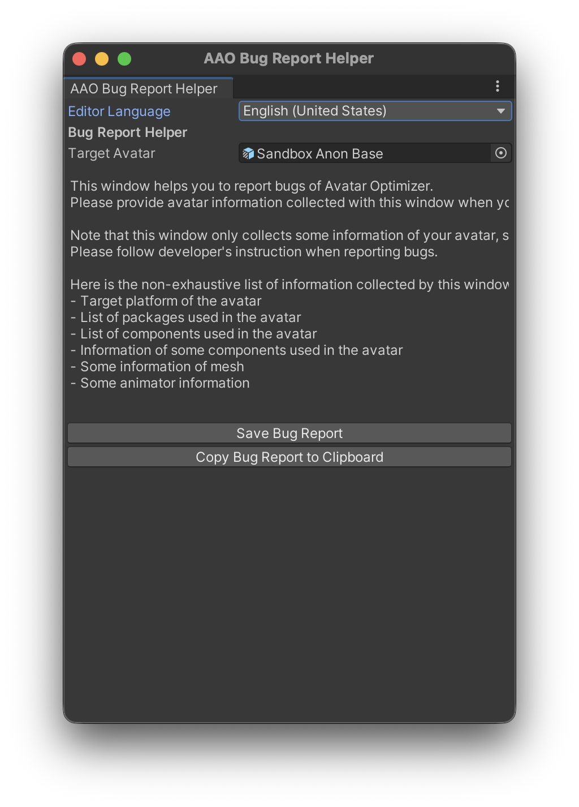

# Bug Report Helper {#bug-report-helper}

AAO: Avatar Optimizerのバグを見つけた場合、報告していただけると調査や修正に取り組むことができます。

バグの詳細を把握して修正するためには、アバターや環境に関する情報が役に立ちます。\
そのような情報を提供しやすくするために、AAO: Avatar OptimizerにはBug Report Helperウィンドウが実装されています。\
このウィンドウはアバターと環境の情報をレポートファイルとしてまとめます。

ただし、ライセンス違反やプライバシーの問題を避けるため、このウィンドウはアバターのすべての情報を収集するのではなく、一般的な情報のみを収集することにご注意ください。\
すなわち、報告する問題の内容に応じて、追加の情報を求められる場合があります。

## 使い方 {#how-to-use}

Bug Report Helperウィンドウはメニューの `Tools > Avatar Optimizer > Bug Report Helper` から開くことができます。

ウィンドウ上部には、報告対象のアバターを指定するためのフィールドがあります。\
発生している問題に関連するアバターをセットしてください。

<blockquote class="book-hint info">

Trace and OptimizeのFeaturesを無効化しているなど、バグを回避するために何らかの設定を行っている場合は、バグレポートを生成する前にその設定を元に戻してください。\
回避設定が有効な状態では、問題の原因を特定することが困難になる場合があります。

</blockquote>

ウィンドウ下部には、`Save Bug Report`と`Copy Bug Report to Clipboard`という2つのボタンがあります。

<blockquote class="book-hint info">

Play Mode中(上部の▶ボタンが青色)の場合、これらのボタンは無効化されます。\
Bug Report Helperを使用する前にPlay Modeを終了してください。(▶ボタンをクリックして灰色にします)。

</blockquote>

`Save Bug Report`ボタンをクリックすると、レポートファイルを圧縮(gz)ファイルとして保存するためのダイアログが開きます。\
圧縮効率が良いため、この方法を推奨します。

`Copy Bug Report to Clipboard`ボタンをクリックすると、レポートファイルのテキストがクリップボードにコピーされます。\
アプリケーションによっては貼り付けることができないほど、非常に長いテキストになる場合があることにご注意ください。

どちらのボタンでも同様のレポートファイルを作成できます。\
レポートファイルを生成するために、Avatar Optimizerはアバターのビルドを実行します。

このウィンドウで収集した情報をバグ報告で提供する場合は、このファイルを直接添付するか、ファイル共有サービスにアップロードし、そのリンクを共有してください。

## レポート内容 {#report-contents}

レポートファイルには以下のような情報(一部)が含まれます:
- アバター情報
  - アバター名
  - アバターのUnityバージョン
  - GameObjectとコンポーネントの一覧
  - 一部コンポーネントの設定(メッシュの一部情報を含む)
- 環境情報
  - Unityのバージョン
  - OS
  - Avatar Optimizerのバージョン
  - 他にインストールされているVPMパッケージのバージョン
- ビルド情報
  - ビルド処理のログ(警告やエラーを含む)

## その他 {#other-contents}

生成されたレポートファイルの内容は{}こちら{}のツールで確認することができます。
