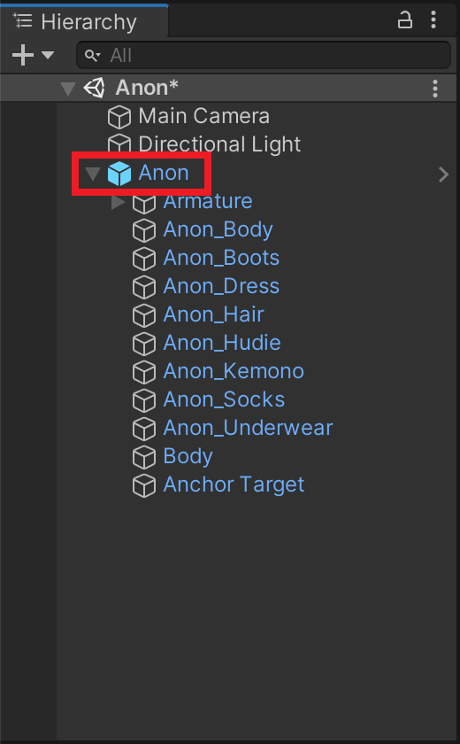

# Avatar Global Components

Avatar Global Component is a kind of component which should be added to an avatar root and applied to whole avatar.

The "avatar root" is the GameObject at the top of the avatar hierarchy.
For example, in the case of a VRChat avatar, the "avatar root" is the GameObject that has the VRC Avatar Descriptor component.

If you add any Avatar Global Components to anything other than the avatar root, you'll see error on the inspector and will not have any effect.

Following components are Avatar Global Component.

- [Trace And Optimize](../../reference/trace-and-optimize)
- [UnusedBonesByReferencesTool](../../reference/unused-bones-by-references-tool)
