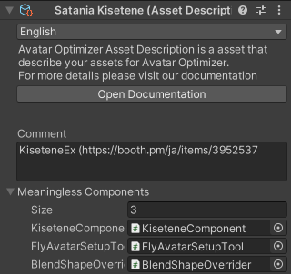

# Asset Description

Asset DescriptionはAvatar Optimizerにアセットの情報を提供するためのファイルです。

## なぜAsset Descriptionが必要なのか {#why-asset-description-is-needed}

Avatar Optimizerは、Asset Descriptionで提供された情報を用いて最適化の失敗を防ぎます。

Asset Descriptionでは、以下の情報を提供することができます。

- Meaningless Components\
  Avatar Optimizerに無視されるべきコンポーネントを指定します。
- Parameters Read By External Tools\
  OSCツールなどの外部ツールから読み取られるパラメーターを指定します。
- Parameters Changed By External Tools\
  OSCツールなどの外部ツールから変更されるパラメーターを指定します。

各項目が必要な理由については以下の説明を参照してください。

### Meaningless Components {#why-meaningless-components}

アバター上の不要な要素を削除するために、Avatar Optimizerはアバターに存在するすべてのコンポーネントのことを知る必要があります。\
Avatar Optimizer v1.6.0で[コンポーネントにAAOとの互換性をもたせるためのドキュメント][make-component-compatible]とAPIが追加されましたが、
非破壊ツールでなく、ビルド時に処理を行わないようなツールでは、`IVRCSDKPreprocessAvatarCallback`でコンポーネントを削除するのは少し面倒だろうと考えました。\
そのため、Avatar Optimizerに無視してほしい、ビルド時やランタイムで処理を行わないコンポーネントを指定するためのシンプルな仕組みとして、Asset Descriptionがv1.7.0で追加されました。

なお、非破壊ツールの場合については、正しくない実行順で処理が行われた場合にAvatar Optimizerがコンポーネントを誤って削除してしまわないように、従来通り`IVRCSDKPreprocessAvatarCallback`やNDMFを使用してAvatar Optimizerの処理よりも先にコンポーネントを削除することを推奨します。

[make-component-compatible]: ../make-your-components-compatible-with-aao

### Parameters Read By Extenral Tools {#why-parameters-read-by-external-tools}

PhysBoneやContact Receiverのようなコンポーネントは、OSCツールで読み取り可能なパラメーターを生成します。
そのようなパラメーターは、Animator ControllerやExpression Parameterに登録しなくても、OSCツールから読み取り可能であることが知られています。\
そのため、Avatar Optimizerはそれらのパラメーターが単に使用されていないものなのか、OSCツールで読み取るためのものなのかを判別することができません。
登録されていないパラメーターがOSCツールで使用されていることは比較的少ないため、コンポーネントが生成するパラメーターがアバター上で全く使われていない場合にはコンポーネントが削除されることになります。

これを防ぐために、OSCツールから読み取られる目的のパラメーターをAsset Descriptionで指定することができます。

### Parameters Changed By External Tools {#why-parameters-written-by-external-tools}

この情報は現在のAvatar Optimizerでは使用されていませんが、将来的に使用することが計画されています。

Avatar Optimizerは、一度も変更されないパラメーターを検知してアニメーターを最適化することを計画しています。
しかしながら、OSCツールのような外部ツールでパラメーターが変更される場合、この最適化はアバターの振る舞いを変えてしまうでしょう。

これを防ぐために、OSCツールから変更されるパラメーターをAsset Descriptionで指定することができます。

## Asset Descriptionの作成 {#create-asset-description}

Asset Descriptionを作成するには、Projectウィンドウの右クリックメニューから`Create/Avatar Optimizer/Asset Description`を選択してください。\
Avatar Optimizerはすべてのファイルの中からファイル検索を行うため、Asset Descriptionの名前、場所は自由です。

## Asset Descriptionの編集 {#edit-asset-description}

### Comment {#comment}

コメント欄はメモを書くためにご自由にお使いください。
Avatar Optimizerはコメントを無視します。

### Meaningless Components {#meaningless-components}

Meaningless ComponentsはAvatar Optimizerに無視してほしいコンポーネントの型の一覧です。
コンポーネントのScript Assetを指定してください。
指定されたScript Assetの型のコンポーネントと、そのサブクラスのコンポーネントはAvatar Optimizerに無視されます。

Asset Descriptionでは実際のScene上のコンポーネントと同様に、Script AssetがguidとfileIDの形で保持されています。
そのため、クラス名を変更したとしても、シーン上のコンポーネントが壊れていない限り、Asset Descriptionでの指定も問題なく機能します。

### Parameters Read By External Tools {#parameters-read-by-external-tools}

OSCツールなどの外部ツールから読み取られるパラメーターを指定します。

詳細は[上のセクション](#why-parameters-read-by-external-tools)を参照してください。

### Parameters Changed By External Tools {#parameters-changed-by-external-tools}

OSCツールなどの外部ツールから変更されるパラメーターを指定します。

詳細は[上のセクション](#why-parameters-written-by-external-tools)を参照してください。
