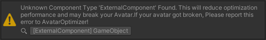

# Make your tool compatible with Avatar Optimizer

This page describes the following two things.

- When your tool can be incompatible with Avatar Optimizer?
- How to improve the compatibility?

If you have some question, please feel free to ask [`@anatawa12@misskey.niri.la` on fediverse][fediverse].

## When your tool can be incompatible with Avatar Optimizer? {#when-incompatible}

If your tool doesn't add any components to the avatar and does nothing on the build time,
your tool is already compatible with Avatar Optimizer!

If your tool adds some components to some portion of Avatar, your tool can be incompatible with Avatar Optimizer.

Since Avatar Optimizer has Garbage Collection system for Components and else, Avatar Optimizer have to 
know about all existing components in your Avatar at the optimization.

To avoid problem with unknown components, the Avatar Optimizer currently assumes unknown components
- have some side-effects.
- will have dependency relationship to all components referenced in the component.
  (They can be changed in the future.)

However, the assumption can be incorrect so Avatar Optimizer will generate the following warning.



If your tool is non-NDMF[^NDMF]-based non-destructive tools that will also be applied on entering play mode,
Avatar Optimizer might be proceed before applying your plugin.

## How to improve the compatibility? {#improve-compatibility}

### For NDMF based non-destructive tools {#improve-compatibility-ndmf-based}

If your tool is a non-destructive tools based on NDMF[^NDMF], please remove your components before
Avatar Optimizer process. Avatar Optimizer does most thing in Optimization pass
so if your plugin do nothing in Optimization pass, nothing is problem.
If your tool needs your components in Optimization pass, 
please execute before Avatar Optimizer with [`BeforePlugin`][ndmf-BeforePlugin]. 
QualifiedName of Avatar Optimizer in NDMF is `com.anatawa12.avatar-optimizer`.

If your tool actually want to do something with your components in Optimization pass,
please [register your component][register-component] to Avatar Optimizer.

### For non-NDMF based non-destructive tools {#improve-compatibility-non-ndmf-based}

If your tool is a non-destructive tools not based on NDMF[^NDMF], please consider
make your tool based on NDMF.

If your tool is applied on play, to ensure compatibility with Avatar Optimizer, you have to use NDMF to
guarantee applying ordering between Avatar Optimizer and your tool.
If your tool does something only on building avatar, making your tool based on NDMF is not required.

If you don't want to make your took based on NDMF, please remove your component before processing Avatar Optimizer.
To achieve this, please execute your tool before NDMF's Optimization pass.
Currently NDMF executes Optimization passes in order `-1025`, JUST before VRCSDK's `RemoveAvatarEditorOnly` callback so
your tool should register `IVRCSDKPreprocessAvatarCallback` with smaller `callbackOrder`.

If your tool actually want to do something with your components after Avatar Optimizer (Optimization pass in NDMF),
please [register your component][register-component] to Avatar Optimizer.

### For other tools that just holds data with components. {#non-destructive-tools}

If your tool holds some information with components and doesn't have meaning at the build time, 
please remove your component before Avatar Optimizer with `IVRCSDKPreprocessAvatarCallback` or 
register your component to Avatar Optimizer.

When you want to remove your component with `IVRCSDKPreprocessAvatarCallback`, please refer [this section](#improve-compatibility-non-ndmf-based).

When you want to register your component to Avatar Optimizer, please refer [this section][register-component].

### Registering your components {#register-component}

If your tool want to keep your component after processing Avatar Optimizer, or want to removed by Avatar Optimizer,
you can register your component to Avatar Optimizer to tell about your component.

To call APIs in Avatar Optimizer, first, Please make assembly definition file[^asmdef] if your tool doesn't have.

Next, add `com.anatawa12.avatar-optimizer.api.editor` to assembly references in asmdef file.
If your tool doesn't want to depends on Avatar Optimizer, please use [Version Defines].
Because Avatar Optimizer didn't have public API piror to 1.6.0 and will break api in 2.0.0, 
it's recommended to add version range like `[1.6,2.0)` (or more stricter like `[1.7,2.0)`).


Then, define `CompoinentInformation` for your component in your assembly.

```csharp
#if AVATAR_OPTIMIZER && UNITY_EDITOR

[ComponentInformation(typeof(YourComponent))]
internal class YourComponentInformation : ComponentInformation<YourComponent>
{
    protected override void CollectMutations(YourComponent component, ComponentMutationsCollector collector)
    {
        // call methods on the collector to tell about the component
    }

    protected override void CollectDependency(YourComponent component, ComponentDependencyCollector collector)
    {
        // call methods on the collector to tell about the component
    }
}

#endif
```

In `CollectDependency`, you should register build-time or run-time dependencies of your component.
In `CollectMutations`, you should register any mutation your component may do.
Please refer xmldoc and method name for more datails.

If your component is just for keeping data for your in-editor tools, both will be empty method.

[fediverse]: https://misskey.niri.la/@anatawa12
[ndmf-BeforePlugin]: https://ndmf.nadena.dev/api/nadena.dev.ndmf.fluent.Sequence.html#nadena_dev_ndmf_fluent_Sequence_BeforePlugin_System_String_System_String_System_Int32_
[register-component]: #register-component

[^asmdef]: The file defines assembly other than Assembly-CSharp. Please refer [unity docs](https://docs.unity3d.com/2019.4/Documentation/Manual/ScriptCompilationAssemblyDefinitionFiles.html).
[^NDMF]: [NDMF], Non-Destructive Modular Framework, is a framework for running non-destructive build plugins when 
building avatars by bdunderscore. Avatar Optimizer uses that framework for compatibility 
with many non-destructive tools based on NDMF.

[NDMF]: https://ndmf.nadena.dev/
[modular-avatar]: https://modular-avatar.nadena.dev/
[Version Defines]: https://docs.unity3d.com/2019.4/Documentation/Manual/ScriptCompilationAssemblyDefinitionFiles.html#define-symbols
