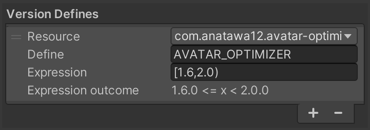

# Shader Information API

Since Avatar Optimizer v1.8.0, Avatar Optimizer provides the Shader Information API to help optimize materials that use your custom shaders.\
By registering shader information, you can enable Avatar Optimizer to perform advanced optimizations like texture atlasing and UV packing.

## What is Shader Information? {#what-is-shader-information}

Shader Information is a way to tell Avatar Optimizer how your shader uses textures, UV channels, and other material properties.

Current Avatar Optimizer optimizes avatars with this information in the following way, but more optimizations might be added later.[^optimization-note]\
Please note that not all optimizations are performed automatically with Trace and Optimize.

- Pack multiple textures into texture atlases (with components like `AAO Merge Material`)
- Remove textures used by shader features but disabled by material settings

Without Shader Information, Avatar Optimizer treats a shader conservatively and cannot perform some of these optimizations.

[^optimization-note]: For example, UV channel optimization is not currently implemented but may be added in future versions.

## Core Concepts {#core-concepts}

### Main Classes {#main-classes}

The Shader Information API consists of three main classes:

- `ShaderInformation`: Base class you extend to provide information about your shader.\
  Override `GetMaterialInformation` method to register texture and UV usage for materials using the shader.
- `ShaderInformationRegistry`: Static class used to [register](#registration-methods) your `ShaderInformation` implementation with Avatar Optimizer during editor initialization.
- `MaterialInformationCallback`: Passed to `GetMaterialInformation`, provides methods to read material properties and register texture and UV usage information.

### Null Values {#null-values}

Throughout the Shader Information API, `null` values have a consistent meaning: they represent either **unknown values** or **animated (statically undecidable) values**.\
When a material property might be animated or its value cannot be determined at build time, the API returns `null` to indicate uncertainty.\
You should pass `null` for parameters when their values cannot be determined statically.

## Getting Started {#getting-started}

To provide Shader Information for your shader, follow these steps:

### 1. Create an Assembly Definition {#create-asmdef}

If your shader package doesn't have an Editor Assembly Definition[^asmdef], create one.\
The assembly should be Editor-only since Shader Information is only used at build time and Shader Information API is only available for Editor build.

### 2. Add Assembly Reference {#add-reference}

Add `com.anatawa12.avatar-optimizer.api.editor` to assembly references in asmdef file.

If you don't want to require Avatar Optimizer as the dependency, use [Version Defines] with symbols like `AVATAR_OPTIMIZER` to detect if Avatar Optimizer is installed and if AAO version is newer than specified version.



We recommended version range like `[1.8,2.0)` (which means supporting v1.8.0 and later but will require updates for v2.0.0).\
Note that some APIs may be added in later versions, so you may need to adjust the version range based on which APIs you use.

### 3. Create Shader Information Class {#create-class}

Create a class that extends `ShaderInformation` and register it with `ShaderInformationRegistry`.\
Registration must be done with `[InitializeOnLoad]` attribute and static constructor to ensure it's registered before Avatar Optimizer processes materials.

```csharp
#if AVATAR_OPTIMIZER && UNITY_EDITOR

using Anatawa12.AvatarOptimizer.API;
using UnityEditor;
using UnityEngine;

namespace YourNamespace
{
    [InitializeOnLoad]
    internal class YourShaderInformation : ShaderInformation
    {
        static YourShaderInformation()
        {
            // Register with shader GUID (recommended for shader assets)
            string shaderGuid = "your-shader-guid-here";
            ShaderInformationRegistry.RegisterShaderInformationWithGUID(
                shaderGuid, 
                new YourShaderInformation()
            );
        }

        public override ShaderInformationKind SupportedInformationKind =>
            ShaderInformationKind.TextureAndUVUsage;

        public override void GetMaterialInformation(MaterialInformationCallback matInfo)
        {
            // Register texture and UV usage here (see examples below)
        }
    }
}

#endif
```

## ShaderInformationKind Flags {#information-kinds}

The `SupportedInformationKind` property tells Avatar Optimizer what information you're providing.

Currently, the following kinds are available for registration:

- `TextureAndUVUsage`: Indicates you provide information about which textures the shader uses, which UV channels each texture samples from, UV transform matrices, and sampler states.\
  See [Registering Texture Usage](#registering-textures).
- `VertexIndexUsage`: Indicates your shader uses vertex indices. If you don't provide this flag, Avatar Optimizer assumes vertex indices are not used and may shuffle vertices during optimization.\
  See [Registering Vertex Index Usage](#register-vertex-index).

This is a flags enum, so you can combine multiple values with the `|` operator.

```csharp
public override ShaderInformationKind SupportedInformationKind =>
    ShaderInformationKind.TextureAndUVUsage | ShaderInformationKind.VertexIndexUsage;
```

## Registering Material Information {#registering-information}

The `GetMaterialInformation` method is called for each material using your shader.\
Use the `MaterialInformationCallback` to register texture and UV usage.

See the API documentation comments for more details on each method.

### Reading Material Properties {#reading-properties}

`MaterialInformationCallback` provides methods to read material properties on the shader.

```csharp
// Read float properties
float? value = matInfo.GetFloat("_PropertyName");

// Read int properties
int? value = matInfo.GetInt("_PropertyName");

// Read Vector4 properties (like _MainTex_ST)
Vector4? value = matInfo.GetVector("_MainTex_ST");

// Check if shader keyword is enabled
bool? enabled = matInfo.IsShaderKeywordEnabled("KEYWORD_NAME");
```

These methods return `null` if the property doesn't exist or the value is unknown.

### Registering Texture Usage {#registering-textures}

Use `RegisterTextureUVUsage` method to tell Avatar Optimizer about each 2D texture.\
See the API documentation comments for details on the parameters.

```csharp
public override void GetMaterialInformation(MaterialInformationCallback matInfo)
{
    // Get the UV transform (scale/offset)
    var mainTexST = matInfo.GetVector("_MainTex_ST");
    Matrix2x3? uvMatrix = mainTexST is { } st
        ? Matrix2x3.NewScaleOffset(st)
        : null;

    // Register the texture
    matInfo.RegisterTextureUVUsage(
        textureMaterialPropertyName: "_MainTex",
        samplerState: "_MainTex",  // Uses sampler from _MainTex property
        uvChannels: UsingUVChannels.UV0,
        uvMatrix: uvMatrix
    );
}
```

#### Sampler States {#sampler-states}

Sampler states define texture wrapping and filtering.\
Most shaders use a sampler from a material property, so use the property name in that case.
(String implicitly converts to `SamplerStateInformation`)

```csharp
matInfo.RegisterTextureUVUsage(
    "_MainTex",
    samplerState: "_MainTex",  // String implicitly converts
    UsingUVChannels.UV0,
    uvMatrix
);
```

If your shader uses inline samplers (e.g., `SamplerState linearClampSampler`), use predefined constants like `SamplerStateInformation.LinearRepeatSampler`.

If the sampler cannot be determined, use `SamplerStateInformation.Unknown`.

#### UV Channels {#uv-channels}

Specify which UV channel(s) the texture samples from using `UsingUVChannels` method.\
For textures that don't use mesh UVs (screen space, MatCap, view-direction based, etc.), use `UsingUVChannels.NonMesh`.

```csharp
matInfo.RegisterTextureUVUsage(
    "_MatCapTexture",
    "_MatCapTexture",
    UsingUVChannels.NonMesh,  // Not from mesh UVs
    null  // No UV transform
);
```

If the UV channel depends on a material property,

```csharp
var uvChannel = matInfo.GetFloat("_UVChannel") switch
{
    0 => UsingUVChannels.UV0,
    1 => UsingUVChannels.UV1,
    _ => UsingUVChannels.UV0 | UsingUVChannels.UV1  // Unknown, could be either
};

matInfo.RegisterTextureUVUsage("_DetailTex", "_DetailTex", uvChannel, uvMatrix);
```

#### UV Transform Matrices {#uv-transform-matrices}

UV transform matrices describe how UVs are transformed before sampling the texture.\
Tipical Unity shaders use Vector4 of `(scaleX, scaleY, offsetX, offsetY)` from material properties (like `_MainTex_ST`).\
You can convert Scale and Offset to a `Matrix2x3` using `Matrix2x3.NewScaleOffset` method.

```csharp
var texST = matInfo.GetVector("_MainTex_ST");
Matrix2x3? uvMatrix = texST is { } st 
    ? Matrix2x3.NewScaleOffset(st)
    : null;
```

You can also build matrices manually if needed.\
If the UV transform is animated or calculated dynamically, use `null`.

### Registering Vertex Index Usage {#register-vertex-index}

When the shader registers vertex index usage, Avatar Optimizer will try to preserve vertex indices from the original mesh.\
This currently disables automatic Merge Skinned Mesh feature in Trace and Optimize, but more features may be affected later.

Since this `RegisterVertexIndexUsage` method is to preserve vertex indices, when your shader uses vertex indices just for generating random sequences, you should not register them.

```csharp
public override void GetMaterialInformation(MaterialInformationCallback matInfo)
{
    // ... register textures ...

    // Check if the feature using vertex indices is enabled
    if (matInfo.GetFloat("_UseVertexIdEffect") != 0)
    {
        // Tell this shader wants Avatar Optimizer to preserve vertex indices
        matInfo.RegisterVertexIndexUsage();
    }
}
```

## Registering Shader Information {#registration-methods}

You have to register your `ShaderInformation` implementation to link to your shader.\
There are two ways to register Shader Information.

### Register by GUID (Recommended) {#register-by-guid}

For shader assets, you can register with the shader's GUID.\
This method is recommended because GUIDs normally don't change, won't duplicate, and don't require accessing AssetDatabase.\
(Accessing AssetDatabase in InitializeOnLoad methods is not valid, so registering by shader instance can become invalid.)

```csharp
ShaderInformationRegistry.RegisterShaderInformationWithGUID(
    "your-shader-asset-guid",
    new YourShaderInformation()
);
```

### Register by Shader Instance {#register-by-instance}

For shaders dynamically created on build or when you have the shader instance, you can register with shader instance.

```csharp
Shader shader = Shader.Find("Your/Shader/Name");
ShaderInformationRegistry.RegisterShaderInformation(
    shader,
    new YourShaderInformation()
);
```

## Best Practices {#best-practices}

### Use InitializeOnLoad {#use-initializeonload}

Register your Shader Information in a static constructor with `[InitializeOnLoad]` attribute to register before 'Apply on Play' builds.

```csharp
[InitializeOnLoad]
internal class YourShaderInformation : ShaderInformation
{
    static YourShaderInformation()
    {
        // Registration happens automatically when Unity loads
        Register();
    }
    
    private static void Register()
    {
        ShaderInformationRegistry.RegisterShaderInformationWithGUID(
            "guid", new YourShaderInformation()
        );
    }
}
```

### Handle Unknown Values {#handle-unknown-values}

Material properties might be animated or unknown.\
Handle `null` values. Even when your shader itself does not support animating a property, Avatar Optimizer may pass it as `null` since Avatar Optimizer may process multiple materials at once.

```csharp
// Use pattern matching
var st = matInfo.GetVector("_MainTex_ST");
Matrix2x3? uvMatrix = st is { } st2 ? Matrix2x3.NewScaleOffset(st2) : null;

// Use union value for null cases
var uvChannel = matInfo.GetFloat("_UVChannel") switch
{
    0 => UsingUVChannels.UV0,
    1 => UsingUVChannels.UV1,
    null => UsingUVChannels.UV0 | UsingUVChannels.UV1,  // Unknown
    _ => UsingUVChannels.UV0 | UsingUVChannels.UV1
};
```

### Check Keywords and Properties {#check-keywords-properties}

Only register textures that are actually used.

```csharp
if (matInfo.IsShaderKeywordEnabled("_NORMALMAP") != false)
{
    // Keyword might be enabled, register normal map
}

if (matInfo.GetFloat("_UseEmission") != 0)
{
    // Emission is enabled, register emission map
}
```

<blockquote class="book-hint info">

`!= false` checks if the value is `true` or `null` (unknown).\
This conservative approach assumes features are enabled if unknown.

</blockquote>

### Provide Accurate Information {#provide-accurate-information}

- Only set `VertexIndexUsage` if vertex indices truly matter
- Use correct sampler states (affects texture filtering during atlasing)
- Set UV matrices to `null` if they're dynamic or animated
- Use `UsingUVChannels.NonMesh` for screen-space UVs

### Use `internal class` for Shader Information Classes {#use-internal-class}

To avoid exposing your Shader Information classes in your assembly's public API, we recommend declaring them as `internal class`.\
This helps keep your codebase clean and prevents accidental misuse of internal details.

If your editor script doesn't have public API, you may set your Assembly Definition Auto Reference to false to avoid exposing classes to `Assembly-CSharp`.

## Complete Examples {#examples}

Here's some simple ShaderInformation examples for simple shaders.

For more complex examples, see Avatar Optimizer's built-in shader information implementations on [GitHub][shader-information-impl].

[shader-information-impl]: https://github.com/anatawa12/AvatarOptimizer/tree/master/Editor/APIInternal/

### Simple Shader with Main Texture {#example-simple}

```csharp
[InitializeOnLoad]
internal class SimpleShaderInformation : ShaderInformation
{
    static SimpleShaderInformation()
    {
        ShaderInformationRegistry.RegisterShaderInformationWithGUID(
            "your-shader-guid",
            new SimpleShaderInformation()
        );
    }

    public override ShaderInformationKind SupportedInformationKind =>
        ShaderInformationKind.TextureAndUVUsage;

    public override void GetMaterialInformation(MaterialInformationCallback matInfo)
    {
        var mainTexST = matInfo.GetVector("_MainTex_ST");
        Matrix2x3? uvMatrix = mainTexST is { } st 
            ? Matrix2x3.NewScaleOffset(st) 
            : null;

        matInfo.RegisterTextureUVUsage(
            "_MainTex",
            "_MainTex",
            UsingUVChannels.UV0,
            uvMatrix
        );
    }
}
```

### Shader with Conditional Features {#example-conditional}

```csharp
[InitializeOnLoad]
internal class FeatureShaderInformation : ShaderInformation
{
    static FeatureShaderInformation()
    {
        ShaderInformationRegistry.RegisterShaderInformationWithGUID(
            "your-shader-guid",
            new FeatureShaderInformation()
        );
    }

    public override ShaderInformationKind SupportedInformationKind =>
        ShaderInformationKind.TextureAndUVUsage;

    public override void GetMaterialInformation(MaterialInformationCallback matInfo)
    {
        // Main texture (always present)
        var mainTexST = matInfo.GetVector("_MainTex_ST");
        Matrix2x3? mainUVMatrix = mainTexST is { } st 
            ? Matrix2x3.NewScaleOffset(st) 
            : null;

        matInfo.RegisterTextureUVUsage(
            "_MainTex", "_MainTex", UsingUVChannels.UV0, mainUVMatrix
        );

        // Normal map (conditional on keyword)
        if (matInfo.IsShaderKeywordEnabled("_NORMALMAP") != false)
        {
            matInfo.RegisterTextureUVUsage(
                "_BumpMap", "_BumpMap", UsingUVChannels.UV0, mainUVMatrix
            );
        }

        // Detail texture (conditional on property)
        if (matInfo.GetFloat("_UseDetail") != 0)
        {
            var detailST = matInfo.GetVector("_DetailTex_ST");
            Matrix2x3? detailUVMatrix = detailST is { } st2 
                ? Matrix2x3.NewScaleOffset(st2) 
                : null;

            var detailUV = matInfo.GetFloat("_DetailUV") switch
            {
                0 => UsingUVChannels.UV0,
                1 => UsingUVChannels.UV1,
                _ => UsingUVChannels.UV0 | UsingUVChannels.UV1
            };

            matInfo.RegisterTextureUVUsage(
                "_DetailTex", "_DetailTex", detailUV, detailUVMatrix
            );
        }

        // MatCap (screen-space, no UV transform)
        if (matInfo.IsShaderKeywordEnabled("_MATCAP") != false)
        {
            matInfo.RegisterTextureUVUsage(
                "_MatCap",
                SamplerStateInformation.LinearClampSampler,
                UsingUVChannels.NonMesh,
                null
            );
        }
    }
}
```

### Shader Using Vertex Indices {#example-vertex-indices}

```csharp
[InitializeOnLoad]
internal class VertexShaderInformation : ShaderInformation
{
    static VertexShaderInformation()
    {
        ShaderInformationRegistry.RegisterShaderInformationWithGUID(
            "your-shader-guid",
            new VertexShaderInformation()
        );
    }

    public override ShaderInformationKind SupportedInformationKind =>
        ShaderInformationKind.TextureAndUVUsage | ShaderInformationKind.VertexIndexUsage;

    public override void GetMaterialInformation(MaterialInformationCallback matInfo)
    {
        var mainTexST = matInfo.GetVector("_MainTex_ST");
        Matrix2x3? uvMatrix = mainTexST is { } st 
            ? Matrix2x3.NewScaleOffset(st) 
            : null;

        matInfo.RegisterTextureUVUsage(
            "_MainTex", "_MainTex", UsingUVChannels.UV0, uvMatrix
        );

        // Shader uses SV_VertexID for effects
        matInfo.RegisterVertexIndexUsage();
    }
}
```

## Support {#support}

If you have questions or need help, ask me on

- **Discord**: [NDMF Discord] mention `@anatawa12`
- **Fediverse**: [@anatawa12@misskey.niri.la][fediverse]
- **GitHub Issues**: [AvatarOptimizer Issues]

[Version Defines]: https://docs.unity3d.com/2019.4/Documentation/Manual/ScriptCompilationAssemblyDefinitionFiles.html#define-symbols
[NDMF Discord]: https://discord.gg/dV4cVpewmM
[fediverse]: https://misskey.niri.la/@anatawa12
[AvatarOptimizer Issues]: https://github.com/anatawa12/AvatarOptimizer/issues

[^asmdef]: The file defines assembly other than Assembly-CSharp. Please refer [unity docs](https://docs.unity3d.com/2022.3/Documentation/Manual/ScriptCompilationAssemblyDefinitionFiles.html).
