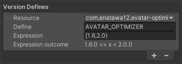

# Shader Information API

Since Avatar Optimizer v1.9.0-beta.5, Avatar Optimizer provides the Shader Information API to help optimize materials for materials with your custom shaders.
By registering shader information, you can enable Avatar Optimizer to perform advanced optimizations like texture atlasing and UV packing.

## What is Shader Information? {#what-is-shader-information}

Shader Information is a way to tell Avatar Optimizer how your shader uses textures, UV channels, and other material properties.

Current Avatar Optimizer optimizes avatars with this information in the following way, but more optimizations might be added later.[^optimization-note]
Please note that not all optimizations are performed automatically with Trace and Optimize.

- Pack multiple textures into texture atlases (with components like `AAO Merge Material`)
- Remove textures used by shader features but disabled by material settings
- Assume vertex indices are not used by the shader (opt-out-able with `VertexIndexUsage` flag)

Without Shader Information, Avatar Optimizer treats your shader conservatively and cannot perform some of these optimizations.

[^optimization-note]: For example, UV channel optimization is not currently implemented but may be added in future versions.

## Core Concepts {#core-concepts}

Throughout the Shader Information API, `null` values have a consistent meaning: they represent either **unknown values** or **animated (statically undecidable) values**. When a material property might be animated or its value cannot be determined at build time, the API returns `null` to indicate uncertainty.

## Getting Started {#getting-started}

To provide Shader Information for your shader, follow these steps:

### 1. Create an Assembly Definition {#create-asmdef}

If your shader package doesn't have an Editor assembly definition, create one.
The assembly should be Editor-only since Shader Information is only used at build time and Shader Information API is only available for Editor build.

### 2. Add Assembly Reference {#add-reference}

Add `com.anatawa12.avatar-optimizer.api.editor` to your assembly definition's references.

If you don't want to require Avatar Optimizer, use [Version Defines] with the symbol `AVATAR_OPTIMIZER`:



Recommended version range: `[1.0,2.0)` (supports v1.x.x but will require updates for v2.0.0)

### 3. Create Shader Information Class {#create-class}

Create a class that extends `ShaderInformation` and register it with `ShaderInformationRegistry`.
Registration must be done in `InitializeOnLoad` to ensure it's registered before Avatar Optimizer processes materials:

```csharp
#if AVATAR_OPTIMIZER && UNITY_EDITOR

using Anatawa12.AvatarOptimizer.API;
using UnityEditor;
using UnityEngine;

namespace YourNamespace
{
    [InitializeOnLoad]
    internal class YourShaderInformation : ShaderInformation
    {
        static YourShaderInformation()
        {
            // Register with shader GUID (recommended for shader assets)
            string shaderGuid = "your-shader-guid-here";
            ShaderInformationRegistry.RegisterShaderInformationWithGUID(
                shaderGuid, 
                new YourShaderInformation()
            );
        }

        public override ShaderInformationKind SupportedInformationKind =>
            ShaderInformationKind.TextureAndUVUsage;

        public override void GetMaterialInformation(MaterialInformationCallback matInfo)
        {
            // Register texture and UV usage here (see examples below)
        }
    }
}

#endif
```

## ShaderInformationKind Flags {#information-kinds}

The `SupportedInformationKind` property tells Avatar Optimizer what information you're providing. This is a flags enum, so you can combine multiple values with the `|` operator:

```csharp
public override ShaderInformationKind SupportedInformationKind =>
    ShaderInformationKind.TextureAndUVUsage | ShaderInformationKind.VertexIndexUsage;
```

### `TextureAndUVUsage` {#texture-uv-usage}

Indicates you provide information about which textures the shader uses, which UV channels each texture samples from, UV transform matrices, and sampler states.

### `VertexIndexUsage` {#vertex-index-usage}

Indicates your shader uses vertex indices (e.g., `SV_VertexID`).

If you **don't** provide this flag, Avatar Optimizer assumes vertex indices are **not used** and may shuffle vertices during optimization.
If your shader uses vertex indices, you **must** set this flag to prevent incorrect rendering.

## Registering Material Information {#registering-information}

The `GetMaterialInformation` method is called for each material using your shader.
Use the `MaterialInformationCallback` to register texture and UV usage.

See the API documentation comments for more details on each method.

### Reading Material Properties {#reading-properties}

The callback provides methods to read material properties on the shader:

```csharp
// Read float properties
float? value = matInfo.GetFloat("_PropertyName");

// Read int properties  
int? value = matInfo.GetInt("_PropertyName");

// Read Vector4 properties (like _MainTex_ST)
Vector4? value = matInfo.GetVector("_MainTex_ST");

// Check if shader keyword is enabled
bool? enabled = matInfo.IsShaderKeywordEnabled("KEYWORD_NAME");
```

These methods return `null` if the property doesn't exist or the value is unknown.

### Registering Texture Usage {#registering-textures}

Use `RegisterTextureUVUsage` to tell Avatar Optimizer about each 2D texture. See the API documentation comments for details on the parameters:

```csharp
public override void GetMaterialInformation(MaterialInformationCallback matInfo)
{
    // Get the UV transform (scale/offset)
    var mainTexST = matInfo.GetVector("_MainTex_ST");
    Matrix2x3? uvMatrix = mainTexST is { } st 
        ? Matrix2x3.NewScaleOffset(st) 
        : null;

    // Register the texture
    matInfo.RegisterTextureUVUsage(
        textureMaterialPropertyName: "_MainTex",
        samplerState: "_MainTex",  // Uses sampler from _MainTex property
        uvChannels: UsingUVChannels.UV0,
        uvMatrix: uvMatrix
    );
}
```
        textureMaterialPropertyName: "_MainTex",
        samplerState: "_MainTex",  // Uses sampler from _MainTex property
        uvChannels: UsingUVChannels.UV0,
        uvMatrix: uvMatrix
    );
}
```

### Sampler States {#sampler-states}

Sampler states define texture wrapping and filtering. Most shaders use a sampler from a material property - use the property name (string implicitly converts to `SamplerStateInformation`):

```csharp
matInfo.RegisterTextureUVUsage(
    "_MainTex",
    samplerState: "_MainTex",  // String implicitly converts
    UsingUVChannels.UV0,
    uvMatrix
);
```

If your shader uses inline samplers (e.g., `SamplerState linearClampSampler`), use predefined constants:

```csharp
// Point filtering
SamplerStateInformation.PointClampSampler
SamplerStateInformation.PointRepeatSampler
SamplerStateInformation.PointMirrorSampler
SamplerStateInformation.PointMirrorOnceSampler

// Linear filtering
SamplerStateInformation.LinearClampSampler
SamplerStateInformation.LinearRepeatSampler
SamplerStateInformation.LinearMirrorSampler
SamplerStateInformation.LinearMirrorOnceSampler

// Trilinear/Anisotropic filtering
SamplerStateInformation.TrilinearClampSampler
SamplerStateInformation.TrilinearRepeatSampler
SamplerStateInformation.TrilinearMirrorSampler
SamplerStateInformation.TrilinearMirrorOnceSampler
```

Example:

```csharp
matInfo.RegisterTextureUVUsage(
    "_NoiseTexture",
    SamplerStateInformation.LinearRepeatSampler,
    UsingUVChannels.NonMesh,
    null
);
```

If the sampler cannot be determined, use `SamplerStateInformation.Unknown`.

### UV Channels {#uv-channels}

Specify which UV channel(s) the texture samples from using `UsingUVChannels`. For textures that don't use mesh UVs (screen space, MatCap, view-direction based, etc.), use `UsingUVChannels.NonMesh`:

```csharp
matInfo.RegisterTextureUVUsage(
    "_MatCapTexture",
    "_MatCapTexture", 
    UsingUVChannels.NonMesh,  // Not from mesh UVs
    null  // No UV transform
);
```

If the UV channel depends on a material property:

```csharp
var uvChannel = matInfo.GetFloat("_UVChannel") switch
{
    0 => UsingUVChannels.UV0,
    1 => UsingUVChannels.UV1,
    _ => UsingUVChannels.UV0 | UsingUVChannels.UV1  // Unknown, could be either
};

matInfo.RegisterTextureUVUsage("_DetailTex", "_DetailTex", uvChannel, uvMatrix);
```

### UV Transform Matrices {#uv-matrices}

UV transform matrices describe how UVs are scaled and offset (like `_MainTex_ST`). Most Unity shaders use a Vector4 with `(scaleX, scaleY, offsetX, offsetY)`:

```csharp
var texST = matInfo.GetVector("_MainTex_ST");
Matrix2x3? uvMatrix = texST is { } st 
    ? Matrix2x3.NewScaleOffset(st)
    : null;
```

You can also build matrices manually if needed. If the UV transform is animated or calculated dynamically, use `null`.

### Registering Other UV Usage {#other-uv-usage}

If your shader uses UVs for purposes other than texture sampling (but only uses the integer part):

```csharp
// Example: UV-based mesh decimation that only uses floor(UV)
matInfo.RegisterOtherUVUsage(UsingUVChannels.UV1);
```

**Note**: Only use this if your shader only uses the integer part of UVs (like UV Tile Discard).
If your shader uses fractional UV values for calculations, this is incorrect.

### Registering Vertex Index Usage {#register-vertex-index}

If your shader uses vertex indices and the feature that uses them is enabled:

```csharp
public override void GetMaterialInformation(MaterialInformationCallback matInfo)
{
    // ... register textures ...

    // Check if the feature using vertex indices is enabled
    if (matInfo.GetFloat("_UseVertexIdEffect") != 0)
    {
        // Tell Avatar Optimizer this shader uses vertex indices
        matInfo.RegisterVertexIndexUsage();
    }
}
```

**Important**: Only call this if vertex indices significantly affect the visual result.

## Complete Examples {#examples}

For more examples, see Avatar Optimizer's built-in shader information implementations on GitHub:
- [VRChat SDK Shaders](https://github.com/anatawa12/AvatarOptimizer/blob/master/Editor/APIInternal/ShaderInformation.VRCSDK.cs)
- [lilToon](https://github.com/anatawa12/AvatarOptimizer/blob/master/Editor/APIInternal/ShaderInformation.Liltoon.cs)
- [Unity Built-in Shaders](https://github.com/anatawa12/AvatarOptimizer/blob/master/Editor/APIInternal/ShaderInformation.Builtin.cs)

### Simple Shader with Main Texture {#example-simple}

```csharp
[InitializeOnLoad]
internal class SimpleShaderInformation : ShaderInformation
{
    static SimpleShaderInformation()
    {
        ShaderInformationRegistry.RegisterShaderInformationWithGUID(
            "your-shader-guid",
            new SimpleShaderInformation()
        );
    }

    public override ShaderInformationKind SupportedInformationKind =>
        ShaderInformationKind.TextureAndUVUsage;

    public override void GetMaterialInformation(MaterialInformationCallback matInfo)
    {
        var mainTexST = matInfo.GetVector("_MainTex_ST");
        Matrix2x3? uvMatrix = mainTexST is { } st 
            ? Matrix2x3.NewScaleOffset(st) 
            : null;

        matInfo.RegisterTextureUVUsage(
            "_MainTex",
            "_MainTex",
            UsingUVChannels.UV0,
            uvMatrix
        );
    }
}
```

### Shader with Conditional Features {#example-conditional}

```csharp
[InitializeOnLoad]
internal class FeatureShaderInformation : ShaderInformation
{
    static FeatureShaderInformation()
    {
        ShaderInformationRegistry.RegisterShaderInformationWithGUID(
            "your-shader-guid",
            new FeatureShaderInformation()
        );
    }

    public override ShaderInformationKind SupportedInformationKind =>
        ShaderInformationKind.TextureAndUVUsage;

    public override void GetMaterialInformation(MaterialInformationCallback matInfo)
    {
        // Main texture (always present)
        var mainTexST = matInfo.GetVector("_MainTex_ST");
        Matrix2x3? mainUVMatrix = mainTexST is { } st 
            ? Matrix2x3.NewScaleOffset(st) 
            : null;

        matInfo.RegisterTextureUVUsage(
            "_MainTex", "_MainTex", UsingUVChannels.UV0, mainUVMatrix
        );

        // Normal map (conditional on keyword)
        if (matInfo.IsShaderKeywordEnabled("_NORMALMAP") != false)
        {
            matInfo.RegisterTextureUVUsage(
                "_BumpMap", "_BumpMap", UsingUVChannels.UV0, mainUVMatrix
            );
        }

        // Detail texture (conditional on property)
        if (matInfo.GetFloat("_UseDetail") != 0)
        {
            var detailST = matInfo.GetVector("_DetailTex_ST");
            Matrix2x3? detailUVMatrix = detailST is { } st2 
                ? Matrix2x3.NewScaleOffset(st2) 
                : null;

            var detailUV = matInfo.GetFloat("_DetailUV") switch
            {
                0 => UsingUVChannels.UV0,
                1 => UsingUVChannels.UV1,
                _ => UsingUVChannels.UV0 | UsingUVChannels.UV1
            };

            matInfo.RegisterTextureUVUsage(
                "_DetailTex", "_DetailTex", detailUV, detailUVMatrix
            );
        }

        // MatCap (screen-space, no UV transform)
        if (matInfo.IsShaderKeywordEnabled("_MATCAP") != false)
        {
            matInfo.RegisterTextureUVUsage(
                "_MatCap",
                SamplerStateInformation.LinearClampSampler,
                UsingUVChannels.NonMesh,
                null
            );
        }
    }
}
```

### Shader Using Vertex Indices {#example-vertex-index}

```csharp
[InitializeOnLoad]
internal class VertexShaderInformation : ShaderInformation
{
    static VertexShaderInformation()
    {
        ShaderInformationRegistry.RegisterShaderInformationWithGUID(
            "your-shader-guid",
            new VertexShaderInformation()
        );
    }

    public override ShaderInformationKind SupportedInformationKind =>
        ShaderInformationKind.TextureAndUVUsage | 
        ShaderInformationKind.VertexIndexUsage;

    public override void GetMaterialInformation(MaterialInformationCallback matInfo)
    {
        // Register textures...
        var mainTexST = matInfo.GetVector("_MainTex_ST");
        Matrix2x3? uvMatrix = mainTexST is { } st 
            ? Matrix2x3.NewScaleOffset(st) 
            : null;

        matInfo.RegisterTextureUVUsage(
            "_MainTex", "_MainTex", UsingUVChannels.UV0, uvMatrix
        );

        // Shader uses SV_VertexID for effects
        matInfo.RegisterVertexIndexUsage();
    }
}
```

## Registration Methods {#registration-methods}

There are two ways to register Shader Information:

### Register by GUID (Recommended) {#register-by-guid}

For shader assets, use the shader's GUID:

```csharp
ShaderInformationRegistry.RegisterShaderInformationWithGUID(
    "your-shader-asset-guid",
    new YourShaderInformation()
);
```

### Register by Shader Instance {#register-by-instance}

For shaders dynamically created on build or when you have the shader instance:

```csharp
Shader shader = Shader.Find("Your/Shader/Name");
ShaderInformationRegistry.RegisterShaderInformation(
    shader,
    new YourShaderInformation()
);
```

**Note:** If the same shader is registered with both methods, the instance registration takes precedence.

## Best Practices {#best-practices}

### Use InitializeOnLoad

Register your Shader Information in a static constructor with `[InitializeOnLoad]`:

```csharp
[InitializeOnLoad]
internal class YourShaderInformation : ShaderInformation
{
    static YourShaderInformation()
    {
        // Registration happens automatically when Unity loads
        Register();
    }
    
    private static void Register()
    {
        ShaderInformationRegistry.RegisterShaderInformationWithGUID(
            "guid", new YourShaderInformation()
        );
    }
}
```

### Handle Unknown Values

Material properties might be animated or unknown. Handle `null` values:

```csharp
// Use pattern matching
var st = matInfo.GetVector("_MainTex_ST");
Matrix2x3? uvMatrix = st is { } st2 ? Matrix2x3.NewScaleOffset(st2) : null;

// Use null-coalescing for defaults
var uvChannel = matInfo.GetFloat("_UVChannel") switch
{
    0 => UsingUVChannels.UV0,
    1 => UsingUVChannels.UV1,
    null => UsingUVChannels.UV0 | UsingUVChannels.UV1,  // Unknown
    _ => UsingUVChannels.UV0 | UsingUVChannels.UV1
};
```

### Check Keywords and Properties

Only register textures that are actually used:

```csharp
if (matInfo.IsShaderKeywordEnabled("_NORMALMAP") != false)
{
    // Keyword might be enabled, register normal map
}

if (matInfo.GetFloat("_UseEmission") != 0)
{
    // Emission is enabled, register emission map
}
```

**Note:** `!= false` checks if the value is `true` or `null` (unknown).
This conservative approach assumes features are enabled if unknown.

### Provide Accurate Information

- Only set `VertexIndexUsage` if vertex indices truly matter
- Use correct sampler states (affects texture filtering during atlasing)
- Set UV matrices to `null` if they're dynamic or animated
- Use `UsingUVChannels.NonMesh` for screen-space UVs

### Test Your Implementation

Test with the `AAO Merge Material` component to verify:

1. Textures can be atlased correctly
2. UV transforms are applied properly
3. No visual artifacts after optimization
4. Materials with different settings are handled correctly

## Support {#support}

If you have questions or need help:

- **Discord**: [NDMF Discord]
- **Fediverse**: [@anatawa12@misskey.niri.la][fediverse]
- **GitHub Issues**: [AvatarOptimizer Issues]

[Version Defines]: https://docs.unity3d.com/2019.4/Documentation/Manual/ScriptCompilationAssemblyDefinitionFiles.html#define-symbols
[NDMF Discord]: https://discord.gg/dV4cVpewmM
[fediverse]: https://misskey.niri.la/@anatawa12
[AvatarOptimizer Issues]: https://github.com/anatawa12/AvatarOptimizer/issues
