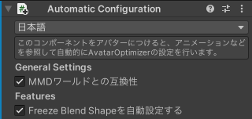

# Automatic Configuration

このコンポーネントは、AvatarOptimizerを自動的に設定します。
チェックボックスで自動設定する機能・対象を選択することが出来ます。

現在、以下の機能の自動設定が可能です。
- [FreezeBlendShape](../freeze-blendshape)
  アニメーションなどで使われていないBlendShapeを自動的に固定・除去します。
- `使われていないGameObjectを自動的に削除する`
  アニメーションなどを走査して、使われていないGameObjectを自動的に削除します。

また、以下の設定で自動設定を調節できます。
- `MMDワールドとの互換性`
  MMDワールドで使われるBlendShapeを固定しないなど、MMDワールドとの互換性を考慮した軽量化を行います。

