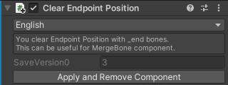

# Clear Endpoint Position

このコンポーネントは、Endpoint Positionの値を0に置換し、`_EndPhysBone`GameObjectを追加します。

今のところ、このコンポーネントに設定項目はありませんが、ボタンが1つあります。
`適用して今すぐcomponentを削除する`をクリックすると、 この操作が適用され、コンポーネントが削除されます。
アバターを開発するときに便利かもしれません。

