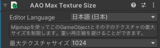

# Max Texture Size

特定のMipmapレベルを削減することでテクスチャサイズを縮小します。\
元のテクスチャフォーマットと設定は保持されます。

このコンポーネントは任意のGameObjectに追加することができ、そのGameObjectとその子孫の全てに適用されます。

複数の`Max Texture Size`コンポーネントがある場合、最も近い親の設定が適用されます。\
また、対象となるテクスチャが異なる設定内容の`Max Texture Size`コンポーネントから同時に影響を受ける場合、最も小さいサイズの設定が適用されます。

## 制限事項 {#limitations}

### Mipmapが必要 {#mipmaps-required}

このコンポーネントを用いてテクスチャをリサイズするには、Mipmapが有効になっている必要があります。\
Mipmapのないテクスチャや、目標の大きさまで縮小するのに十分なMipmapレベルを持っていないテクスチャはスキップされ、警告が表示されます。

### Crunch圧縮に非対応 {#crunch-copmpressed-textures}

Crunch圧縮を使用しているテクスチャはリサイズすることができません。\
Crunch圧縮されたテクスチャはスキップされ、警告が表示されます。

## 設定 {#settings}

### 最大テクスチャサイズ {#max-texture-size}

テクスチャサイズの上限を選択します。
