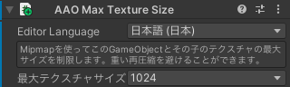

# Max Texture Size

Reduce texture size by extracting specific mipmap levels, preserving the original texture format and settings.

This component can be added to any GameObject and applies to that GameObject and all its children.

When multiple Max Texture Size components are present, the closest parent's setting is used, and if a texture is affected by multiple settings, the minimum size is applied.

## Limitations

### Mipmaps Required

Textures must have mipmaps enabled to be resized. Textures without mipmaps or textures that don't have enough mipmap levels to reach the target size will be skipped with a warning.

### Incompatible with Crunch Compression {#crunch-compressed-textures}

Textures using Crunch compression cannot be resized. A warning will appear in the build log if Crunch compressed textures are detected.

## Settings

### Max Texture Size

Select the maximum texture size.
