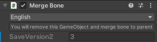

# Merge Bone

<blockquote class="book-hint info">

[Trace And Optimize](../trace-and-optimize) will automatically do the same process, so in most cases you do not need to use this component.

</blockquote>

If you add this component to some GameObject, the GameObject will be removed and merged to parent GameObject.
Also, if some other components are attached to the target GameObject, they will be removed too.

If the parent GameObject also have Merge Bone component, two GameObjects are merged to their further parent GameObject.

All children of GameObject where this component is applied will belong to parent of this GameObject.

## Settings

- `Avoid Name Conflict`\
  Avoids animation problems with name conflict by renaming child GameObjects
