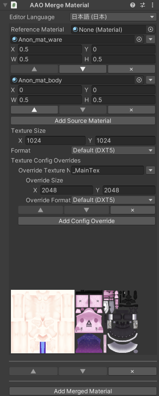

# Merge Material

Merge multiple materials with same shaders to one material by packing texture manually.

This component should be added to a GameObject which has a Skinned Mesh Renderer or Mesh Renderer component. (Kind: [Modifying Edit Skinned Mesh Component with basic mesh support](../../component-kind/edit-skinned-mesh-components#modifying-component))

This component supports shaders with ShaderInformation provided.\
Currently, Avatar Optimizer provides ShaderInformation for some popular shaders like Standard, ToonLit and ToonStandard by VRChat SDK, and lilToon but shader authors can add support for this component by providing ShaderInformation.

This component will create new materials thus material slots which have the materials created by this component will not be merged by `AAO Merge Skinned Mesh` component.\
You should add `Merge Material` to the GameObject which has `AAO Merge Skinned Mesh` component if you want to merge materials from multiple renderers.

## Settings

Click `Add Merged Material` to add material merge group. 
One material is generated for one merge group, and materials in one merge group must have exactly the same shader.

For each merge group, there is `Add Source` button. Clicking this button would add source for the merge material.\
For each source material, you must set where to the texture will place to.
Please change X, Y, W, H to fit to where you want.

For all properties other than UV-based textures (including screen-space textures like MatCaps, Dithers, Noise), the value from the `Reference Material` will be used if set, otherwise the value from the first source material will be used.

For each merge group, there is Texture Config settings.
You can set the size and format of the generated textures for all textures, and override them for each texture property name.

## Limitations

- This component does not support animations replacing the materials.

- This component requires textures used in the materials to have some fixed-transform, so features like Parallax, UV-Scroll are not supported.
