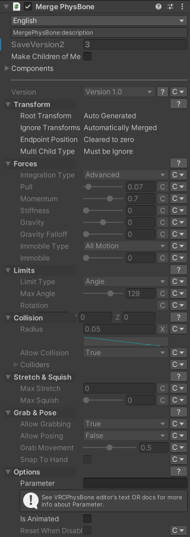

# Merge PhysBone (MergePB) {#merge-physbone}

This component merges multiple PhysBone Components into one Component with MultiChildType == Ignore.

This component should be added to a new GameObject.

## Notes

Merge target PhysBones must be children of the same GameObject.
Alternatively, you can use `Make Children of Me` option.

This component will create a new PhysBone root GameObject and make the bones swayed by merge target PhysBones into children of this GameObject.

Since the root GameObject is treated as a PhysBone affected Transforms, the number of `PhysBone Affected Transforms` will be increased by one for each Merge PhysBone.\
The GameObject added by this component will not be swayed by PhysBone, so this can be a bug of the VRChat Performance Rank System.

When merging multiple PhysBones, the Grab behavior changes.\
Before merging, each PhysBone can be held simultaneously, but after merging, only one bone can be held at a single time.\
This is because there is one grab point per one PhysBone component.

## Settings

### Make Children of Me

Make the bones swayed by merge target PhysBones into children of this GameObject.

### Components

The list of PhysBone Component.

Drop to None element at the bottom to add PhysBone and reset to None to remove from the list.

### Overrides

Below the configurations, there's configurations like VRCPhysBone.
For each property, you may select `Copy` to copy value from source property
(only available if values from the sources are same) or `Override` to set new value instead.

For colliders, you can select `Merge` to merge colliders array from source physbones.

For Endpoint Position, you can select `Clear` to apply [Clear Endpoint Position](../clear-endpoint-position)

For Limit Rotation, you can select `Fix` to fix different roll axis on the model.
If your model has different roll bones, you can limit their rotations together with this option.
