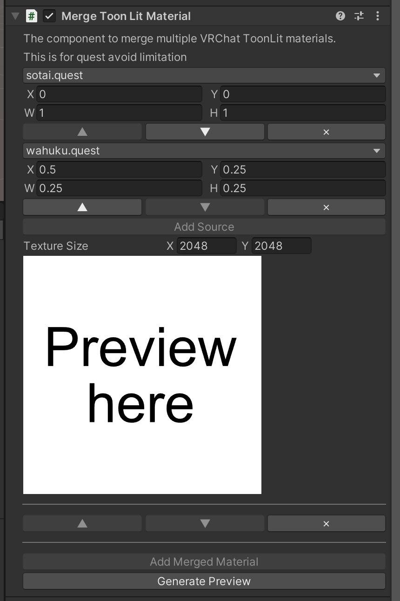

# Merge ToonLit Material

<blockquote class="book-hint warning">

This component is obsolete.

Please use [Merge Material](../merge-material/) component, which supports more shaders than this component and has better save format.\
This component will never receive any further improvements.

</blockquote>

Merge `VRChat/Mobile/Toon Lit` materials to one material by packing texture manually.

This component should be added to a GameObject which has a SkinnedMeshRenderer component. (Kind: [Modifying Edit Skinned Mesh Component](../../component-kind/edit-skinned-mesh-components#modifying-component))

This component currently only supports `VRChat/Mobile/Toon Lit` because I believe there are big demands
but I may add support for other shaders. (also for third-party shaders)
If you want other shader support, please write a [issue][issue]

This component will create new materials thus material slots which have the materials created by this component will not be merged by `AAO Merge Skinned Mesh` component.
You should add `Merge ToonLit Material` to the GameObject which has `AAO Merge Skinned Mesh` component if you want to merge materials from multiple renderers.

## Settings

Click `Add Merged Material` to add merged material.
For each merged material, you can set multiple source materials from materials.
Click `Add Source` or select your material from dropdown menu.
For each source material, you must set where to the texture will placed to.
Please change X, Y, W, H to fit to where you want.
Click `Generate Preview` to generate each texture and see preview.

[issue]: https://github.com/anatawa12/AvatarOptimizer/issues/new/choose
