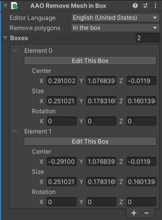
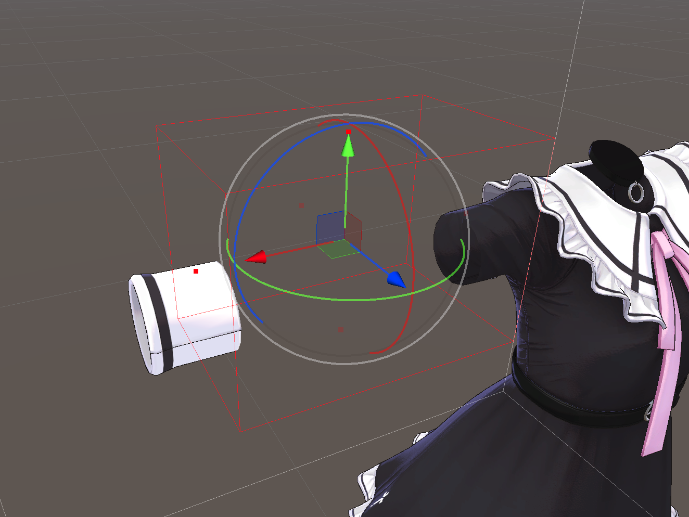
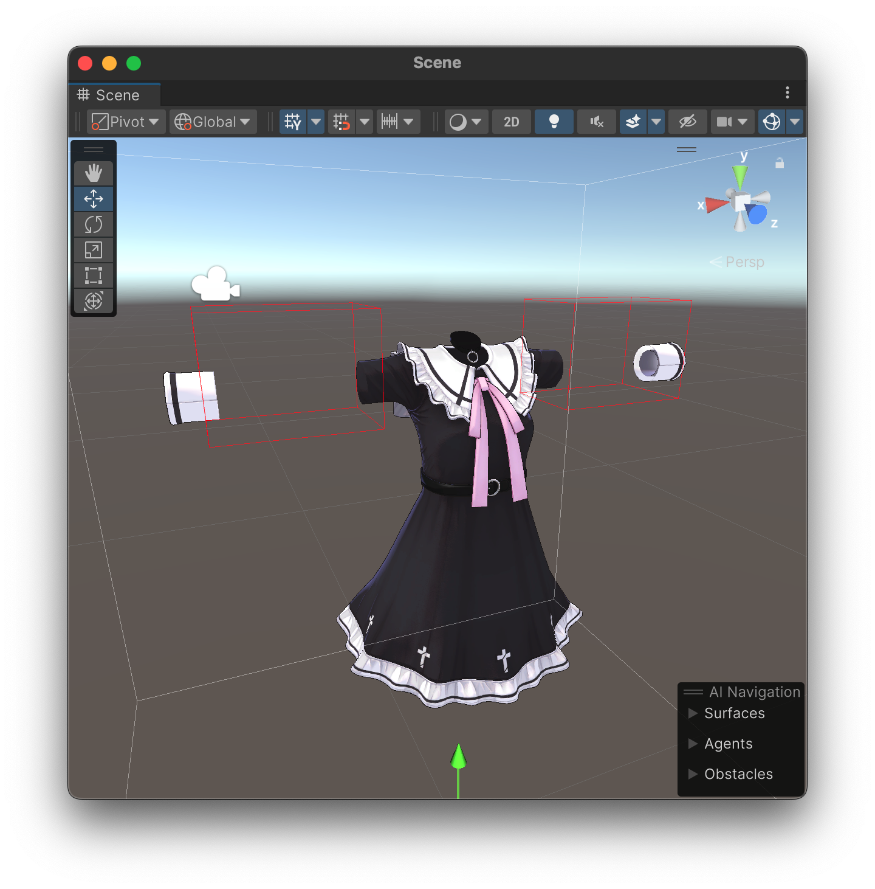

# Remove Mesh By Box

Remove some polygons with any of specified boxes.

This component should be added to a GameObject which has a Skinned Mesh Renderer or Mesh Renderer component. (Kind: [Modifying Edit Skinned Mesh Component with basic mesh support](../../component-kind/edit-skinned-mesh-components#modifying-component))

## Benefits

By removing polygons which are hidden by clothes or something, you can reduce rendering cost, BlendShape processing cost, etc. without affecting the appearance so much.

## Settings

### Remove Polygons

You can choose whether to remove polygons in the any of boxes or outside the all boxes.

### Boxes

The list of boxes for removing polygons.

You can add a box by changing size of the list with number on the right of `Boxes`.

You can change the center position, size, and rotation of each box with the inspector. (In local coordinate of Skinned Mesh Renderer)

Alternatively, you can edit the box with Gizmo by clicking `Edit This Box`.

You can move or rotate the box with handle at the center of the box, and scale the box with dots on the faces of the box.

## Example

With boxes shown on upper image, meshes in the box will be removed as lower image shows.

