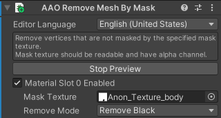
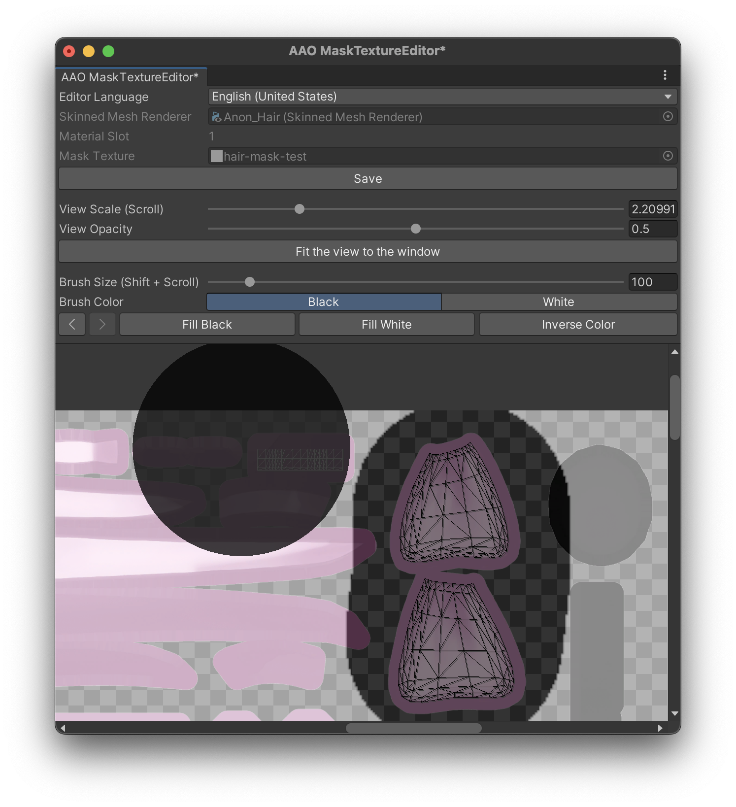

# Remove Mesh By Mask

マスクテクスチャで指定した範囲のポリゴンを削除します。

このコンポーネントは、SkinnedMeshRendererコンポーネントかMeshRendererコンポーネントのあるGameObjectに追加してください。(種類: [MeshRenderer対応Edit Skinned Mesh Component](../../component-kind/edit-skinned-mesh-components#modifying-component))

## 利点 {#benefits}

服で隠れていたりして見えないような部分のメッシュを削除すると、見た目に影響させずに描画負荷やBlendShapeの処理負荷などを減らして軽量化することができます。

このコンポーネントを使用すると、アルファマスク用のテクスチャや、gatosyocoraさんの[MeshDeleterWithTexture]用のマスクテクスチャを利用して簡単にメッシュを削除することができます。

[MeshDeleterWithTexture]: https://github.com/gatosyocora/MeshDeleterWithTexture

## 設定 {#settings}

メッシュのマテリアルスロットの一覧が表示されます。\
マスクテクスチャによるポリゴンの削除を行う対象のマテリアルスロットを選択してください。

### マスクテクスチャ {#mask-texture}

ポリゴンの削除に利用するマスクテクスチャです。\
何もセットされていない場合は、「作成」ボタンをクリックしてテクスチャを新規作成することができます。

「編集」ボタンをクリックすると、マスクテクスチャエディターが開きます。

### 削除モード {#remove-mode}

マスクテクスチャは物によって色が異なるため、対応するモードを選択する必要があります。

黒(に近い色)の場合にポリゴンを削除するように設計されているマスクテクスチャを利用する場合は、`Remove Black`に設定してください。\
白(に近い色)の場合にポリゴンを削除するように設計されているマスクテクスチャを利用する場合は、`Remove White`に設定してください。

## マスクテクスチャエディター {#mask-texture-editor}

このウィンドウでマスクテクスチャを編集することができます。

ウィンドウの上部には、編集中のマスクテクスチャに関する情報が表示されます。\
中央には、表示とブラシサイズについての設定が表示されます。\
ウィンドウの下部には、元のテクスチャ、マスクテクスチャ、メッシュのUVが表示されます。

マスクテクスチャを塗るには左ドラッグします。また、右ドラッグまたはShift + 左ドラッグでビューを移動することが出来ます。\
スクロールでズームイン/アウトが、Shift + スクロールでブラシサイズの変更が出来ます。
