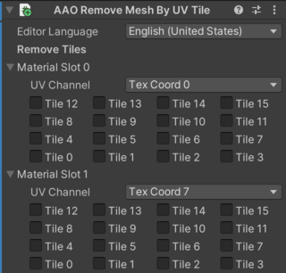

# Remove Mesh By UV Tile

UVタイルで指定した範囲のポリゴンを削除します。

このコンポーネントは、SkinnedMeshRendererコンポーネントまたはMeshRendererコンポーネントのあるGameObjectに追加してください。(種類: [基本メッシュ対応Edit Skinned Mesh Component](../../component-kind/edit-skinned-mesh-components#modifying-component))

## 利点 {#benefits}

服で隠れていたりして見えないような部分のメッシュを削除すると、見た目に影響させずに描画負荷やBlendShapeの処理負荷などを減らして軽量化することができます。

このコンポーネントを使用すると、PoiyomiやlilToonのUV Tile Discard機能を使用してモデルの一部が隠せるようになっている場合に、簡単にメッシュを削除することができます。\
これは、UV Tile DiscardのVertexモードのように動作します。

UV Tile Discardについての詳細は、[UV Tile DiscardについてのPoiyomiのドキュメント][UV Tile Discard]をご参照ください。

なお、何らかの非破壊ツールを使用してモデルのUVタイリングを行っても問題ありません。

[UV Tile Discard]: https://www.poiyomi.com/special-fx/uv-tile-discard

## 設定 {#settings}

メッシュのマテリアルスロットの一覧が表示されます。
削除を行う対象のUVタイルを選択してください。

UVタイル選択欄の上部で、UVチャンネルを指定することもできます。
PoiyomiやlilToonのUV Tile Discard機能とは異なり、このコンポーネントではあらゆるUVチャンネルをUVタイル選択用のUVとして指定することができます。
