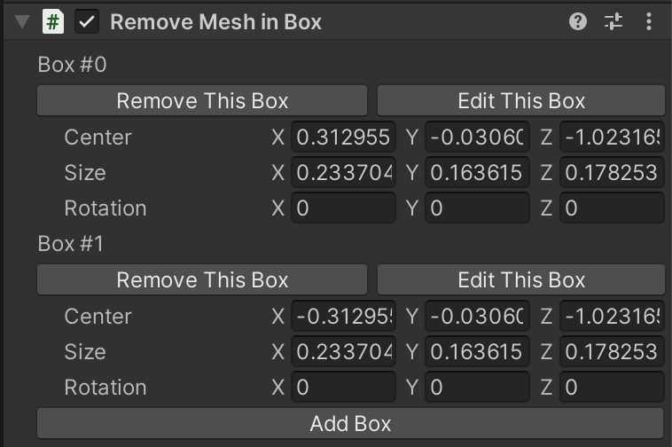
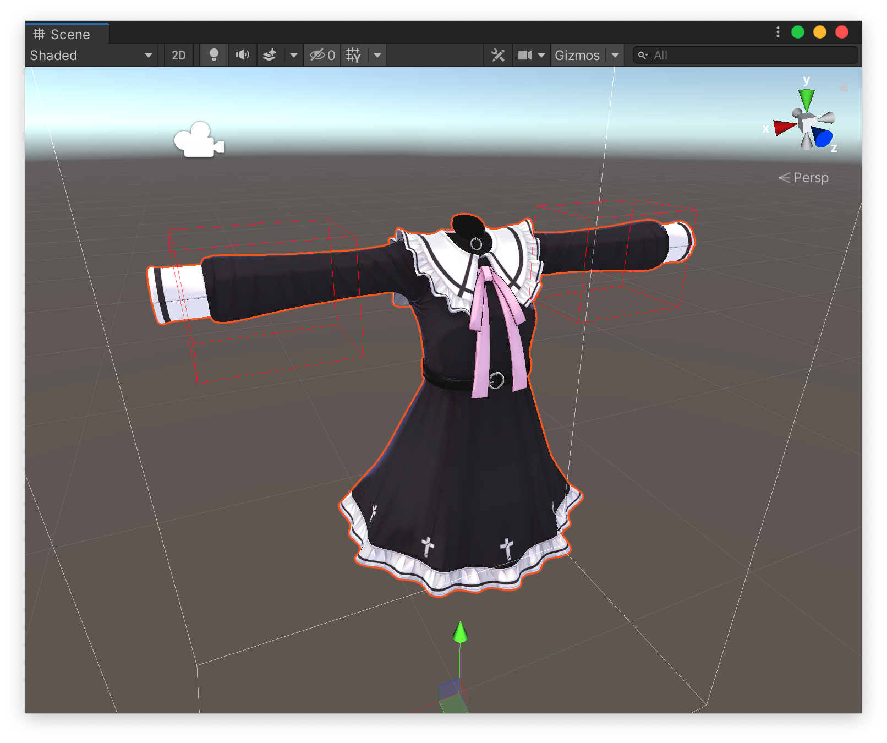

# Remove Mesh in Box

Remove some polygons in any of specified boxes.

This component should be added to a GameObject which has a SkinnedMeshRenderer component. (Kind: [Modifying Edit Skinned Mesh Component](../../component-kind/edit-skinned-mesh-components#modifying-component))

## Benefits

By removing polygons which are hidden by clothes or something, you can reduce rendering cost, BlendShape processing cost, etc. without affecting the appearance so much.

## Settings

Adjust the value to add box.
For each box, you can change the center Position, Size, and Rotation of the box. (In local coordinate)

Click `Edit This Box` to show Gizmo to edit the box like below. You can scale, move and rotate the box.

## Example

With boxes shown on upper image, meshes in the box will be removed as lower image shows.

