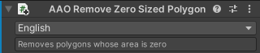

# Remove Zero Sized Polygon

Remove polygons whose area are zero.

This component should be added to a GameObject which has a SkinnedMeshRenderer component.

<blockquote class="book-hint warning">

Since this component works very late in the build process, this component is **NOT** [Modifying Edit Skinned Mesh Component](../../component-kind/edit-skinned-mesh-components#modifying-component).

Adding this component to the SkinnedMeshRenderers to be merged by [Merge Skinned Mesh](../merge-skinned-mesh) component has no effect.

</blockquote>

## Benefits

By removing polygons whose area are zero, you can reduce rendering cost.
This will have almost zero effect on the appearance.

## Notes

In some shaders, even if size of polygon in model file is zero, something can be rendered so
there may be effect on the appearance.

## Settings

This Component doesn't have any configuration for now.

## Notes

This component will be added by [Trace and Optimize](../trace-and-optimize) component.
I recommend you to use Trace and Optimize instead of adding this component manually.
