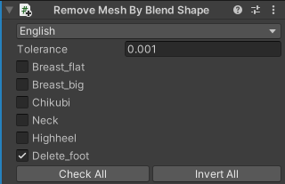

# Rename BlendShape

Renames BlendShapes in the Mesh.\
If renamed name is duplicated, it will merge the BlendShapes into one.

This component should be added to a GameObject which has a SkinnedMeshRenderer component. (Kind: [Modifying Edit Skinned Mesh Component](../../component-kind/edit-skinned-mesh-components#modifying-component))

## Settings

You'll see the list of BlendShape mapping.

Click upper right '+' button to add new mapping.

If the renamed name is duplicated, it will be shown in yellow color to indicate that it will be merged.
