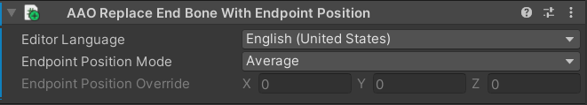

# Replace End Bone With Endpoint Position

This component replaces the End Bone, which is the tip bone in a PhysBone, with an Endpoint Position.

Add this component to the GameObject that has the PhysBone component.

If multiple PhysBone components are attached to the GameObject with this component, the settings will be applied to all of them.

## Settings {#settings}

### Endpoint Position Mode {#endpoint-position-mode}

Select how the value for the Endpoint Position is determined.

- `Average`\
  Calculates the average of the local positions of all End Bones and uses that value as the Endpoint Position.

- `Manual`\
  Uses the value specified in `Value for Endpoint Position` as the Endpoint Position.

### Value for Endpoint Position {#value-for-endpoint-position}

Only available when `Endpoint Position Mode` is set to `Manual`.

Manually specify the local position to use for the Endpoint Position.