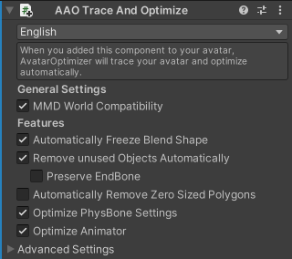

# Trace And Optimize (T&O) {#trace-and-optimize}

<i>昔のバージョンではAutomatic Configurationという名前でした</i>

このコンポーネントは、アバターを走査して自動的にできる限りの最適化を行います。
チェックボックスで自動的に行う最適化を選択することが出来ます。

このコンポーネントはアバターのルートに追加してください。(分類: [Avatar Global Component](../../component-kind/avatar-global-components))

<blockquote class="book-hint info">

Trace and Optimizeは「**見た目に絶対に影響させてはならない**」という前提の下で、かなり慎重に作られています。\
そのため、見た目に影響が出たり、何らかのギミックが機能しなくなったりといった問題が発生した場合はすべて、例外なくAAOのバグとなります。\
従って、問題が起きた際は報告していただければ、出来る限り修正いたします。

</blockquote>

現在、以下の機能を使った自動最適化が可能です。
- `BlendShapeを最適化する`\
  <small>以前は`BlendShapeを自動的に固定・除去する`という名前でしたが、機能が増えたため名前が変わりました。</small>\
  アニメーションなどを走査して、BlendShapeを自動的に固定・除去・統合することでBlendShapeの数を削減します。
- `使われていないObjectを自動的に削除する`\
  アニメーションなどを走査して、使われていないObject(GameObjectやコンポーネントなど)を自動的に削除します。\
  また、切り替えるものと一緒に使われていて、他の方法で使われていないPhysBooneコンポーネントを自動的に切り替えるようにします。
  - `endボーンを残す`\
    親が削除されていないendボーン[^endbone]を削除しないようにします。
- `PhysBoneの設定を最適化する`\
  PhysBoneの設定について、以下の最適化を行います。
  - 全く同じ設定のPhysBone Colliderを1つに統合します。
  - 不要な場合に`Is Animated`のチェックを外します。
- `アニメーターの最適化`\
  Animator Controllerを最適化します。詳細は[このセクション](#animator-optimizer)を参照してください。
- `スキンメッシュレンダラーを統合する`\
  分かれている必要のないスキンメッシュレンダラーを統合します。\
  場合により、自動では一部のメッシュを統合しないこともあるため、必要に応じて[Merge Skinned Mesh](../merge-skinned-mesh)を使用してください。
  - `マテリアルスロットの前後関係を変えることを許可する`\
    マテリアルスロットの前後関係を変えることで、アバターの描画負荷を減らせる場合があります。\
    多くの場合、マテリアルスロットの前後関係は特に意味を持ちませんが、描画順に影響を与える場合もあるようです。
- `テクスチャを最適化する`\
  見た目に影響を与えずにテクスチャを最適化します。\
  現在は、AvatarOptimizerが対応しているシェーダーが使用されているマテリアルに対してのみ、UVパッキングやテクスチャサイズの縮小を行います。

また、以下の設定で自動設定を調節できます。
- `MMDワールドとの互換性`\
  MMDワールドで使われるBlendShapeを固定しないなど、MMDワールドとの互換性を考慮した軽量化を行います。

加えて、以下の高度な最適化が利用出来ます。

- `面積がゼロのポリゴンを自動的に削除する`\
  面積がゼロのポリゴンを削除します。
  これは一部のシェーダーやアニメーションによるスケール変化を壊す可能性があるため、注意して使用してください。

他に、バグの回避などに使用するための高度な設定がありますが、それらは不安定であり、不用意に変更するべきではありません。
それらの機能については英語のTooltipやソースコード、または開発者の指示を参考にしてください。



[^endbone]: AAOは名前が`end`(大文字小文字の区別なし)で終わるボーンをendボーンとして扱います。

## アニメーターの最適化 {#animator-optimizer}

この機能では、現在、アニメーターに対して以下の最適化を行います。

(最適化処理の詳細な仕様は、将来的に変更される可能性があります。)

- AnyState式のレイヤーをEntry-Exit式に変換\
  アニメーターコントローラーのレイヤーをできる限りDiamond型のEntry-Exit式に変換します。
  また、後述の最適化により、AnyState式のレイヤーは最終的にBlendTreeに変換されることがあります。

  ```mermaid
  ---
  title: AnyState式Layer
  ---
  graph LR;
        AnyState(AnyState);
        Entry(Entry) --> State1;
        AnyState --> State1(State1);
        AnyState --> State2(State2);
        AnyState --> State3(State3);
  
  classDef default fill:#ab8211
  classDef node stroke-width:0px,color:#ffffff
  classDef state fill:#878787
  style AnyState fill:#29a0cc
  style Entry fill:#15910f
  class Entry,State1,State2,Exit node
  class State1 default
  class State2,State3 state
  ```

- 完全グラフ式のレイヤーをEntry-Exit式に変換\
  完全グラフを構成しているアニメーターコントローラーのレイヤーをできる限りDiamond型のEntry-Exit式に変換します。\
  また、後述の最適化により、完全グラフのレイヤーは最終的にBlendTreeに変換されることがあります。

  ```mermaid
  ---
  title: Complete Graph layer
  ---
  graph LR;
        Entry(Entry) --> State1;
        State1(State1) --> State2(State2);
        State1 --> State3(State3);
        State2 --> State1;
        State2 --> State3;
        State3 --> State1;
        State3 --> State2;
  
  classDef default fill:#ab8211
  classDef node stroke-width:0px,color:#ffffff
  classDef state fill:#878787
  %%style AnyState fill:#29a0cc
  style Entry fill:#15910f
  class Entry,State1,State2,Exit node
  class State1 default
  class State2,State3 state
  ```

- Entry-Exit式のレイヤーをBlendTreeに変換\
  アニメーターコントローラーのレイヤーをできる限りBlendTreeに変換します。\
  現在、Diamond型、およびLinear型のEntry-Exit式のレイヤーがBlendTreeに変換されます。

  ```mermaid
  ---
  title: Diamond型Entry-Exit式レイヤー
  ---
  graph LR;
        Entry(Entry);
        Entry --> State1(State1);
        Entry --> State2(State2);
        Entry --> State3(State3);
        State1 --> Exit(Exit);
        State2 --> Exit;
        State3 --> Exit;
  
  classDef default fill:#ab8211
  classDef node stroke-width:0px,color:#ffffff
  classDef state fill:#878787
  style Exit fill:#ba202f
  style Entry fill:#15910f
  class Entry,State1,State2,Exit node
  class State1 default
  class State2,State3 state
  ```

  ```mermaid
  ---
  title: Linear型Entry-Exit式レイヤー
  ---
  flowchart LR;
        Entry(Entry) --> State1(State1);
        State1 --> State2(State2);
        State2 --> Exit(Exit);

  classDef node stroke-width:0px,color:#ffffff
  classDef defaultState fill:#ab8211
  classDef state fill:#878787
  style Exit fill:#ba202f
  style Entry fill:#15910f
  class Entry,State1,State2,Exit node
  class State1 defaultState
  class State2 state
  ```

- BlendTreeを統合\
  複数のBlendTreeレイヤーを1つのDirect BlendTreeに統合します。
- 使われていないレイヤーを削除する\
  StateやTransitionがないレイヤーを削除します。
