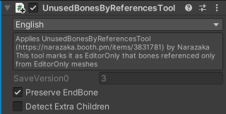

# UnusedBonesByReferencesTool

EditorOnlyなメッシュからしか参照がないボーンをEditorOnlyにします。

このコンポーネントはアバターのルートに追加してください。(分類: [Avatar Global Component](../../component-kind/avatar-global-components))

<blockquote class="book-hint warning">

このコンポーネントは非推奨です。代わりに[Trace and Optimize](../trace-and-optimize)の`使われていないObjectを自動的に削除する`を使用してください。
このコンポーネントの動作が改善されることはありません。

</blockquote>

これはNarazakaさんの[UnusedBonesByReferencesTool][UnusedBonesByReferencesTool]を移植したものですが、ビルド時に実行します。

[UnusedBonesByReferencesTool]: https://narazaka.booth.pm/items/3831781

