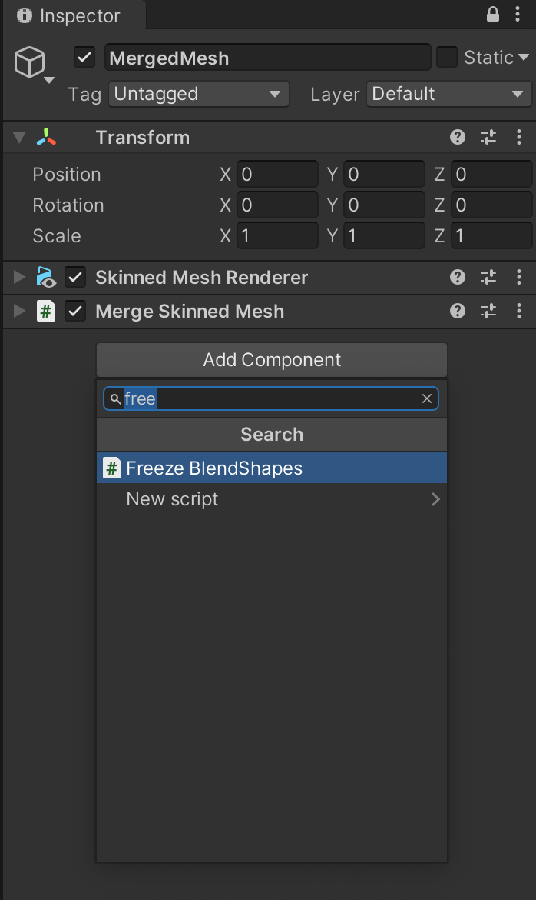

基本的な使い方
===

メッシュを結合してMesh Renderersを減らす {#merge-skinned-mesh}
--

Avatar Optimizerを使用すると簡単にSkinned Meshを結合することができます！



**なせSkinned Meshを結合するの？**

SkinnedMeshを結合するとメッシュを変形させる処理の回数が減るため軽くなります。
また、MergeSkinnedMeshで結合すると同じマテリアルのマテリアルスロットを結合できるので、描画処理の回数も減らす事ができます



今回はまず初めに一番単純なパターンとしてAnonちゃんを軽量化します

まず初めにマージ先のGameObjectを作りましょう。
アバターのGameObjectを右クリックから `Create Empty` をクリックして新たなGameObjectを作ります。
そしたらわかりやすい名前に変えておいてください。この記事では`MergedMesh`とします

そしたら`Merged Mesh`に`Merge Skinned Mesh`を追加しましょう。

すると`Merge Skinned Mesh`と`Skinned Mesh Renderer`が追加されます。

この`Merge Skinned Mesh`コンポーネントは、指定された`Skinned Mesh Renderer`を一緒についている`Skinned Mesh Renderer`にマージするコンポーネントです。
マージを機能させるために`Merge Skinned Mesh`にマージする`Skinned Mesh Renderer`を指定しましょう！

指定を楽にするために、`MergedMesh`を選択した状態でinspectorをロックしましょう。
こうすることで複数のS`Skinned Mesh Renderer`をまとめてドラックアンドドロップできるようになります。[^tip-lock-inspector]

それではHierarchyで顔のメッシュであるBody以外の`Skinned Mesh Renderer`を選択してどロックバンドドロップでSkinned Renderersに指定しましょう！



**なせ顔のメッシュを結合しないの？**

BlendShapeは頂点数とBlendShape数の積に比例して重くなる処理です。
そのため、BlendShapeの数が多い顔のメッシュを頂点数の多い体のメッシュと結合するとかえって重くなってしまうため、顔は別のままにするのを推奨しています



続いて、`MergedMesh`の`Skinned Mesh Renderer`の設定をしましょう！

`Merge Skinned Mesh`は諸事情[^merge-skinned-mesh]によりボーン、メッシュ、マテリアル以外の設定を自動的には行いません。
そのため、Bounds, Root Bone, Anchor Override等を手動で設定してください。
Anchor Overrideは素体のを、Root BoneはHipsを指定するとうまくいくことが多いと思います。

[^tip-lock-inspector]: PhysBoneに複数のコライダーを指定するのにも使えたり、色んなところで使えるので覚えておくと便利だと思います。
[^merge-skinned-mesh]: Boundsは大きな箱にすることで今後対応予定、Root Bone/Anchor Overrideは等しくないとマージできないため対応予定がないです。もし良いアルゴリズムを教えてください。

BlendShapeを固定する {#freeze-blendshape}
---

また、Avatar Optimizerを使用すると簡単にBlendShapeを固定することができます！



**なせBlendShapeを固定するの？**

前述のように、BlendShapeは頂点数とBlendShape数の積に比例して重くなる処理です。
また、BlendShapeはweightに関わらず存在するだけで負荷になってしまいます。
そのためPerformance Rankには反映されませんが固定することが軽量化になります。
可能であれば結合したメッシュはBlendShapeが存在しないmeshにすると良いです。



それでは使わない素体や服のの体型変更用のBlendShapeを結合してみましょう！

頂点数が増えたメッシュである先程の`MergedMesh`に`Freeze BlendShapes`を追加しましょう！

`Freeze BlendShape`は一緒についている`Skinned Mesh Renderer`のBlendShapeを固定するコンポーネントです。

マージを機能させるために固定するBlendShapeを指定しましょう！
チェックボックスにチェックするとそのBlendShapeは固定されます。

これでBlendShapeの固定の設定は終わりです！
