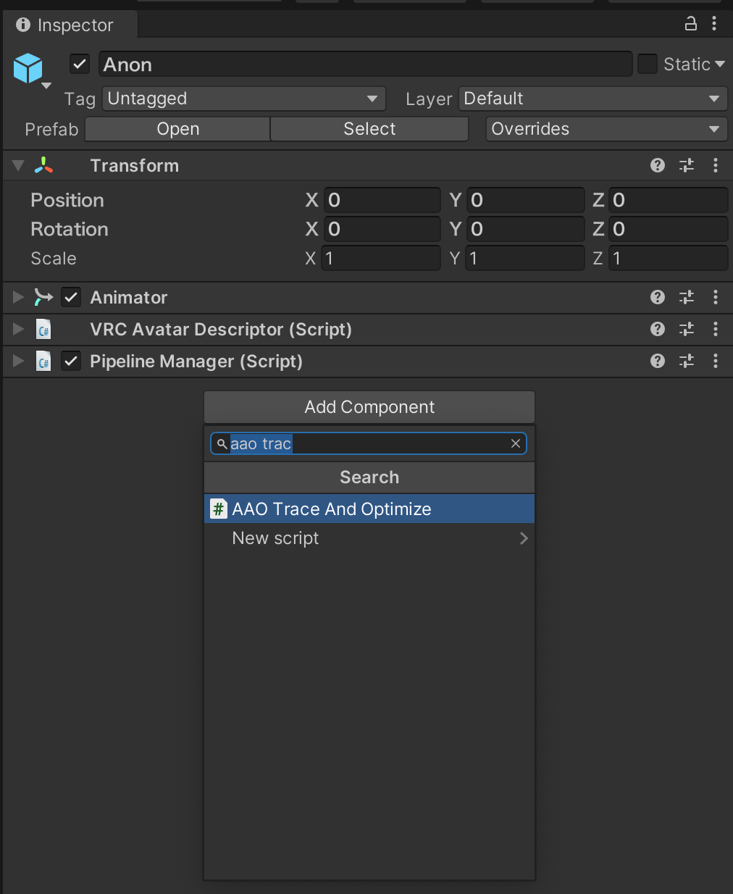
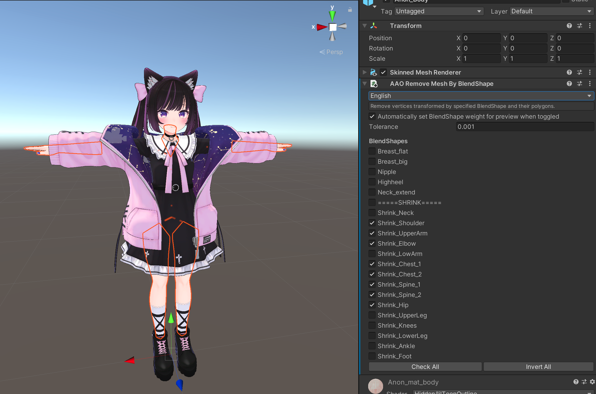
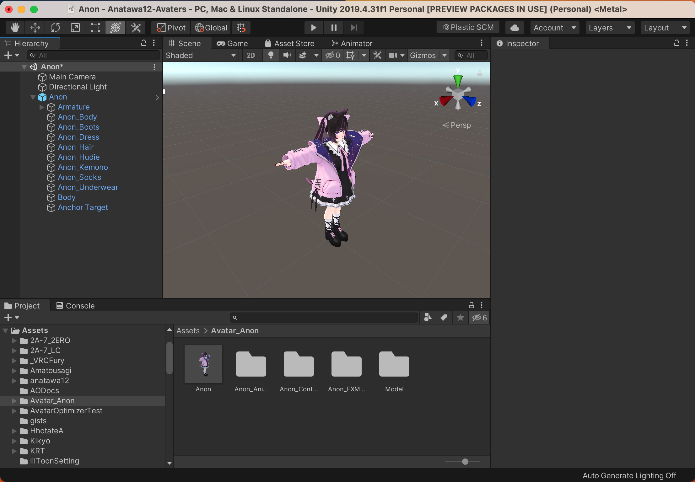
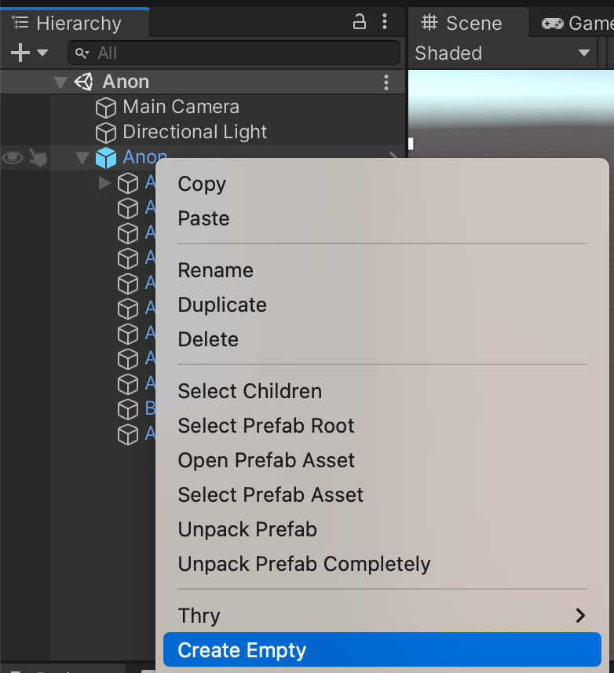
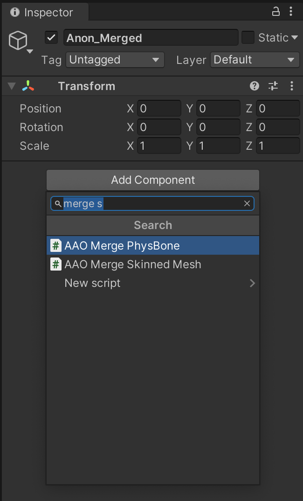
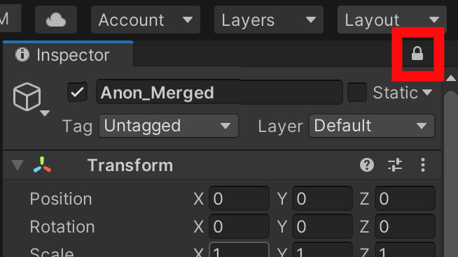
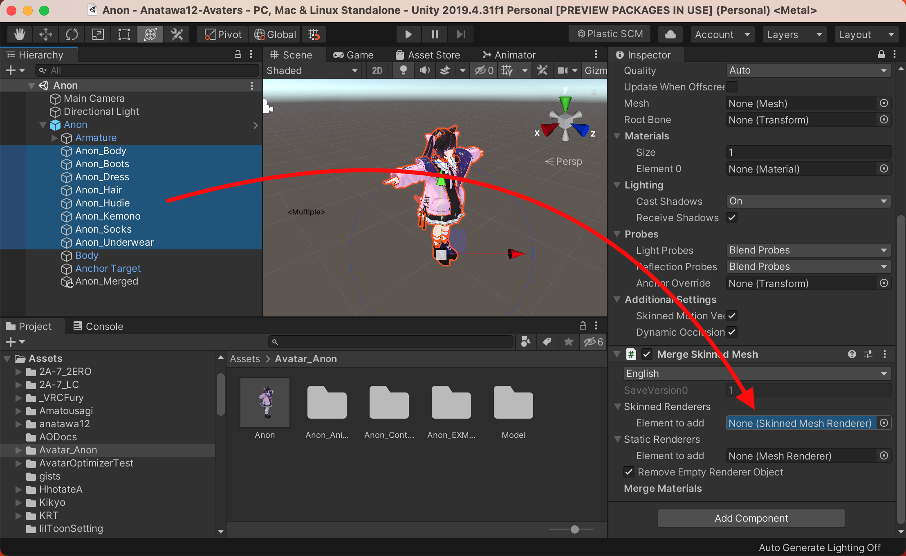

Basic Usage
===

Use Automatic Optimization {#trace-and-optimize}
---

There are several optimizations which can be performed automatically for Avatars.

- Removing Unused BlendShapes(Shape Keys)[^blend-shape]
  - For BlendShapes with non-zero weight, freezing BlendShapes will reduce processing cost.
  - Even if the weight is zero, removing BlendShapes will reduce the size of avatars.
- Removing unused Behaviours such as PhysBones
  - If there are enabled PhysBones which do not need to be swayed (e.g., the swaying target mesh[^mesh] is always disabled), extra computational cost is caused.
- Merging bones which is not animated or swayed with PhysBones
  - If the clothes bones are nested into the body bones, there will be many bones which are never moved locally. Such bones cause extra cost.
- Merging meshes which are toggled together or never toggled
  - If your avatar has only one cloth, it might not be necessary to have separated meshes for body, hair, and clothes.
  - Even if you have multiple switchable clothes, it might not be necessary to have separated meshes with body, hair, and underwear.

With AvatarOptimizer, these optimizations can be performed automatically by simply adding `AAO Trace And Optimize` component to the Avatar Root!

[^blend-shape]: BlendShape is the name of Morphing in Unity. Maya call them as Target Shape, Blender calls them as Shape Key, Metasequoia and MMD call them as Morph.
[^mesh]: In this document, mesh means SkinnedMeshRenderer or MeshRenderer, not the Mesh asset in Unity.

Upload Avatar
---

Now that you have added `AAO Trace and Optimize` component, let's try uploading your avatar!
AAO: Avatar Optimizer is a non-destructive avatar modification tool, and processes avatars on entering play mode or building them.
Therefore, no special steps are required for uploading.
Upload your avatar via VRCSDK Control Panal as usual.

However, even though the hard limit will not be exceeded through Avatar Optimizer optimization, etc., the upload button cannot be pressed if the limit has been exceeded at the time of the VRCSDK pre-build check.\
You can skip the pre-build check with several ways. Please refer [faq][skip-hard-limit-faq] for more details.

[skip-hard-limit-faq]: ../../faq/#i-cannot-upload-the-avatar-because-of-pre-build-hard-limit-check

[Upload without pre-check]: https://github.com/Sayamame-beans/Upload-without-preCheck?tab=readme-ov-file#upload-without-pre-check

<blockquote class="book-hint info">

### Checking performance rank without uploading avatar {#performance-rank-without-upload}

When using non-destructive avatar modification tools, Performance Rank on the VRCSDK Control Panel is no loner be relied upon.

Instead, you can check Performance Rank in Play Mode with Actual Performance Window of anatawa12's Gist Pack.
Please check [basic usages of anatawa12's Gist Pack][gists-basic-usage] and [documentation of Actual Performance Window][Actual Performance Window] for more details。

[gists-basic-usage]: https://vpm.anatawa12.com/gists/ja/docs/basic-usage/
[Actual Performance Window]: https://vpm.anatawa12.com/gists/ja/docs/reference/actual-performance-window/

</blockquote>

<blockquote class="book-hint info">

### Applying non-destructive tools manually {#how-to-manual-bake}

You can use `NDM Framework/Manual bake avatar` on the context menu of the Avatar GameObject to apply non-destructive tools manually.

This will clone your avatar and apply non-destructive tools to the cloned avatar, so your original avatar will not be modified.

This can be useful in some cases (e.g. when exporting a VRChat avatar in VRM format).

</blockquote>

Reduce polygons with BlendShapes which shrink parts of the body {#remove-mesh-by-blendshape}
---

By removing polygons which are hidden by clothes or something, you can reduce rendering cost, BlendShape processing cost, etc. without affecting the appearance so much.
To make this easier, AvatarOptimizer allows you to remove polygons with BlendShapes for shrinking parts of the body, which many avatars have!

Let's add `AAO Remove Mesh By BlendShape` component to Body Mesh, and select BlendShapes from the BlendShapes list below that shrink the parts of the body you want to remove!

In case polygons you want to remove are not removed, or you do not want to remove are removed, you need to adjust the `Tolerance` value!
`Tolerance` decides how much the vertex is moved by BlendShape to be removed.
If some parts intended to be removed are not removed, increase the value a little; otherwise, decrease it a little!

<!--
TODO: add advanced usage for tutorial

Merge Meshes to reduce # of Skinned Renderers {#merge-skinned-mesh}
---

You can easily merge Skinned Mesh with Avatar Optimizer!
Merging Skinned Mesh will not allow you to turn them on and off individually, but merging them will reduce rendering cost!

<blockquote class="book-hint info">

**Why will we merge Skinned Mesh?**

Merging Skinned Mesh will reduce number of deforming mesh (skinning).
Also, Merging with MergeSkinnedMesh can reduce material slots so we can reduce number of drawing.

</blockquote>

This time, I'll optimize Anon-chan as a simplest case.

First, create GameObject for merged mesh.
Right-click avatar GameObject and click `Create Empty` to create new GameObject.
Then, rename to understandable name. In this document, I call it as `Anon_Merged`.

Then, Add `AAO Merge Skinned Mesh` component to `Anon_Merged`.

This adds `AAO Merge Skinned Mesh` component and `Skinned Mesh Renderer` component (which will be the merged mesh).

To make it easy to specifying merge target meshes to `AAO Merge Skinned Mesh` component, lock the inspector with `Anon_Merged` selected.
This allow us to drag & drop multiple meshes at once.[^tip-lock-inspector]

Then, select meshes except for Body, which is the face mesh, and drag & drop to Skinned Renderers of `AAO Merge Skinned Mesh` component!

<blockquote class="book-hint info">

**Why don't we merge face meshes?**

BlendShape (Shape Keys) is a feature became heavier in proportion to the count of vertices and BlendShapes.
Therefore, merging face mesh, which has many BlendShapes, and body mesh, which has many vertices, can make your avatar heavier than before
so I recommend not to merge face mesh.

</blockquote>

Next, configure `Anon_Merged`!

Because of many reasons[^merge-skinned-mesh], `AAO Merge Skinned Mesh` component doesn't configure anything except of bones, meshes, materials, BlendShapes and bounds.
So, please configure Anchor Override, Root Bone and so on yourself on the merged mesh (`Skinned Mesh Renderer` component which is added at the same time as the `AAO Merge Skinned Mesh`component).
I think specifying what is configured in your avatar's body as Anchor Override, and setting `Hips` as the Root Bone will work well.

[^tip-lock-inspector]: It is useful to keep in mind that it can be used in many other places such as specifying multiple colliders for PhysBone.
[^merge-skinned-mesh]: Root Bone and Anchor Override are impossible to merge automatically I think. If you know any good algorithm, please tel me that.
-->
