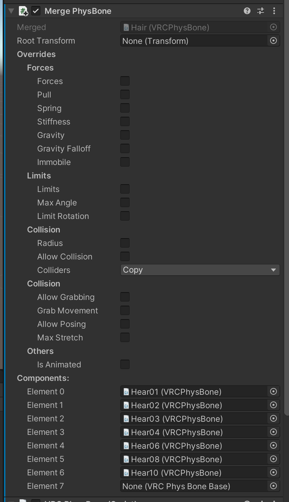
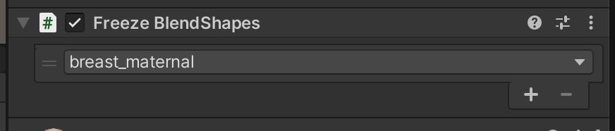
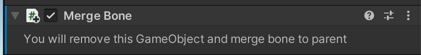
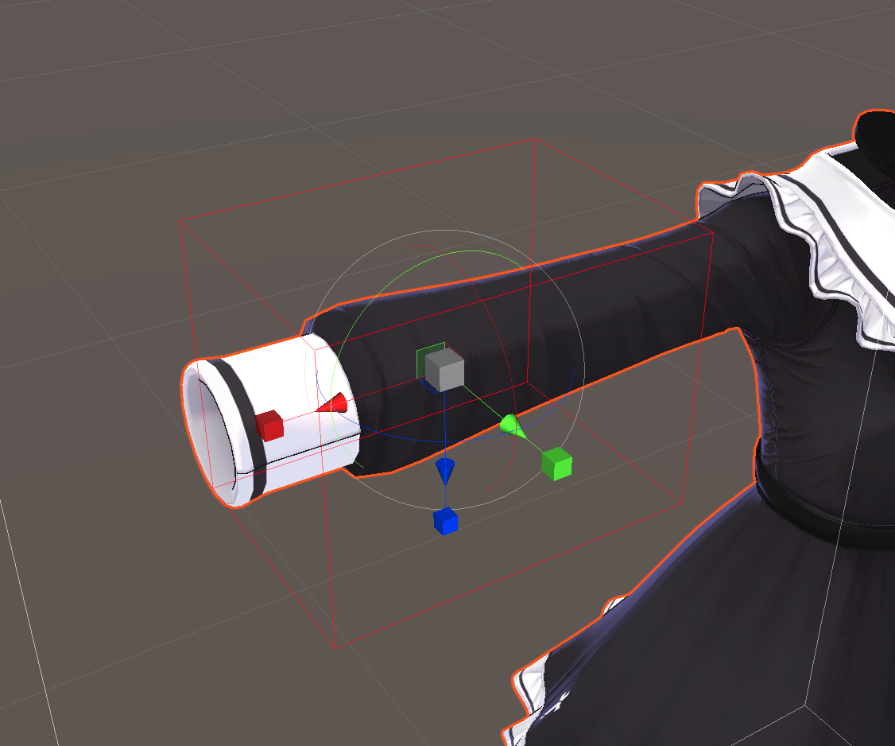

Avatar Optimizer
====

[![GitHub release][shields-latest-release]][github-latest]
[![GitHub deployments][shields-deployment-master]][github-latest]
[![GitHub deployments][shields-deployment-vpm]][vpm-repository]
[![VPM release][shields-vpm]][vpm-repository]

[shields-latest-release]: https://img.shields.io/github/v/release/anatawa12/AvatarOptimizer?display_name=tag&sort=semver
[shields-deployment-vpm]: https://img.shields.io/github/deployments/anatawa12/AvatarOptimizer/vpm.anatawa12.com?label=VPM%20Deployment
[shields-deployment-master]: https://img.shields.io/github/deployments/anatawa12/AvatarOptimizer/master%20branch?label=Deployment
[shields-vpm]: https://img.shields.io/vpm/v/com.anatawa12.avatar-optimizer?repository_url=https%3A%2F%2Fvpm.anatawa12.com%2Fvpm.json

Set of Anatawa12's Small Avatar Optimization Utilities.
Those utilies are applied on entering play mode or building VRC Avatars.

If you have problems or questions about this tool, please feel free to contact me on [twitter][twitter] or [Misskey (Activity Pub)][misskey]!

## Installation

### Using Installer UnityPackage with VPM

With [VPAI] You can include this package just importing one unitypackage.

1. download installer unitypackage [here][installer unitypackage 0.2.x].
2. Make sure your project contains [`vpm-resolver`][vpm-resolver]. If your project is VRChat Avatars/Worlds project with VCC, It's installed.
3. Import the unitypackage into your project.

<details>
  <summary>other versions</summary>

- [0.1.x][installer unitypackage 0.1.x]
- [0.x.x including beta releases][installer unitypackage 0.x beta]

</details>

### Using VPM CommandLine Interface

You may install this package using [VPM/VCC CLI][vcc-cli].

```bash
# add our vpm repository
vpm add repo https://vpm.anatawa12.com/vpm.json
# add package to your project
cd /path/to/your-unity-project
vpm add package com.anatawa12.avatar-optimizer
```

## Components

### Merge Skinned Mesh

Merges one or more SkinnedMeshRenderer and MeshRenderers into one SkinnedMeshRenderer.

You should add MergeSkinnedMesh onto new GameObject with SkinnedMeshRenderer without specified Mesh.

This component will merge mesh, bones, and BlendShapes but other settings will not be modified.
Please edit SkinnedMeshRenderer component attached to same GameObject as MergeSkinnedMesh to set AnchorOverride or else.

BlendShapes is a heavy feature proportion to the count of vertices.
Merging SkinedMesh increases vertices so It's better to freeze & remove static BlendShape before or after merging SkinnedMesh.
There's component for this operation [Freeze BlendShape](#freeze-blendshape). You can add Freeze BlendShape to either / both merge source SkinnedMeshRenderer or / and merged SkinnedMeshRenderer.
If you have variable blend shapes, you should not merge too many SkinnedMeshes.
For example, if you have separated mesh between body and face, you should not merge body and face Meshes because blendshape of face will be used to change facial expression but body mesh not.
This component is good for Merging your clothes and body.

#### Settings


##### Skinned Renderers

The list of SkinnedMeshRenderers to be merged. 

Drop to None element at the bottom to add renderer and reset to None to remove from the list.

#### Static Renderers

The list of MeshRenderers (without mesh transform).

Those meshes are transformed to polygons weighted to one bone, the GameObject that MeshRenderer belongs to.

Drop to None element at the bottom to add renderer and reset to None to remove from the list.

#### Remove Empty Renderer GameObject

If this checkbox is checked and the GameObject SkinnedRenderer belongs to does not have 
any other components than SkinnedMeshRenderer, the GameObject will be removed from Hierarchy.

#### Merge Materials

If MergeSkinnedMesh component found some Materials used in multiple renderers, the Materials will be listed here.

Check Merge to merge those MaterialSlots (SubMeshes) into one MaterialSlot. This reduces DrawCalls.

### Merge PhysBone

This component merges multiple PhysBone Components into one Component with MultiChildType == Ignore.

#### Settings



##### Root Transform

The RootComponent the VRCPhysBone will be applyed to.
If this is set, all GameObjects on the path to VRCPhysBone Component will be disabled via multi child and Ignore Transforms.
If this is not set, parent GameObject of all VRCPhysBone components must be same & one GameObject for Root Transform will be generated.

If RootTransform is set
```
GameObject1 - The RootTransform
 +- GameObject2
 |   +- GameObject3
 |   |   +- GameObject4 - The PhysBone will be merged
 |   |   |   `- Children
 |   |   `- _dummy - the GameObject will be generated for MultiChildType == Ignore
 |   `- _dummy - the GameObject will be generated for MultiChildType == Ignore
 +- GameObject5 - The PhysBone will be merged
 |   `- Children
 `- GameObhect6 - This GameObject will be added to Ignore Transforms
     `- Children
 There's no _dummy for GameObject1 because there's multiple PhysBone targets
```

If RootTransform is not set, This GameObject Graph 
```
GameObject1
 +- GameObject2 - The PhysBone will be merged
 |   `- Children
 +- GameObject3 - The PhysBone will be merged
 |   `- Children
 `- GameObhect4
     `- Children
```

Will Transformed to the following
```
GameObject1 - RootTransform is set
 +- GameObhect4
 |   `- Children
 `- PhysBoneRoot - The Root Transform added by MergePhysBone
     +- GameObject2 - The PhysBone will be merged
     |   `- Children
     `- GameObject3 - The PhysBone will be merged
         `- Children
```

In addition, Endpoint Position will be replaced to zero and `_EndPhysBone` GameObject will be added.
This operation is same as [Clear Endpoint Position](#clear-endpoint-position).

##### Overrides

The list of properties to be merged.
If you check some of this, the value of Merged Component will be used.
If not checked, MergePhysBone will check all PhysBone Components have same value and the value will be used.

##### Components

The list of PhysBone Component.

Drop to None element at the bottom to add renderer and reset to None to remove from the list.

### Freeze BlendShape

Freeze & remove BlendShape from the mesh.

#### Settings



You'll see list of blend shapes and check to freeze blend shape.

### Merge Bone

If you add this component to some GameObject, this GameObject will be removed and bone is merged to parent bone.

If the parent component also have Merge Bone component, two bones are merged to parent of parent bone and so on.

All children of GameObject this component is applied to will belongs to parent of this GameObject.

This Component doesn't have any configuration for now.



### Clear Endpoint Position

This component will replaces EndpointPosition to 0 with adding `_EndPhysBone` GameObject.

This component doesn't have any configuration for now but there's one button on the view.
Clicking `Apply and Remove component` will applies this operation and removes this component.
This may be useful for developing avatars.


### Merge Toon Lit Material

Merge `VRChat/Mobbile/Toon Lit` materials to one material with Manual Texture Packing.

This component currently only supports `Toon Lit` because I believe there are big demands
but I may add support for other materials. (also for third-party shaders) 
If you have some materials, please write a [issue][issues]

#### Settings

Click `Add Merged Material` to add merged material.
For each merged material, you can set multiple source materials from materials. 
Click `Add Source` or select your material from dropdown menu.
For each source material, you must set where to the texture will placed to.
Please change X, Y, W, H to fit to where you want.
Click `Generate Preview` to generate each texture and see preview.


### Remove Mesh in Box

Remove some polygons in any of specified boxes.

#### Settings

Click Add Box button at the bottom to add box.
For each box, you can change the center Position, Size, and Rotation of the box. 
The center position is in local coordinate of the object.


Click Edit This Box to show Gizmo to edit the box like above. You can scale, move and rotate the box.



#### Example

With boxes shown on upper/left image, meshes in the box will be removed as lower/right image shows.


[twitter]: https://go.anatawa12.com/twitter.vrchat
[misskey]: https://go.anatawa12.com/misskey.vrchat
[vpm-repository]: https://vpm.anatawa12.com/vpm.json
[github-latest]: https://github.com/anatawa12/AvatarOptimizer/releases/latest
[vcc-cli]: https://vcc.docs.vrchat.com/vpm/cli
[vpm-resolver]: https://vcc.docs.vrchat.com/vpm/resolver
[installer unitypackage 0.2.x]: https://github.com/anatawa12/VPAI-unitypackages/raw/master/bin/AvatarOptimizer-0.2.x-installer.unitypackage
[installer unitypackage 0.1.x]: https://github.com/anatawa12/VPAI-unitypackages/raw/master/bin/AvatarOptimizer-0.1.x-installer.unitypackage
[installer unitypackage 0.x beta]: https://github.com/anatawa12/VPAI-unitypackages/raw/master/bin/AvatarOptimizer-0.x.x-beta-installer.unitypackage
[issues]: https://github.com/anatawa12/AvatarOptimizer/issues/new
[VPAI]: https://github.com/anatawa12/VPMPackageAutoInstaller
